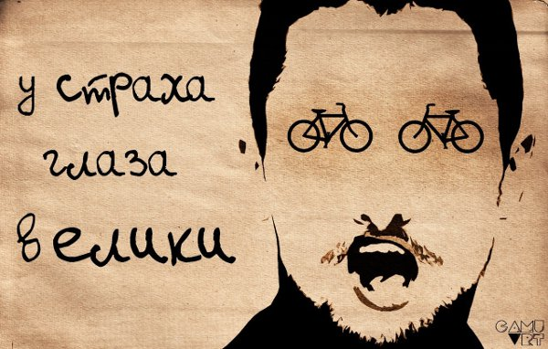
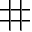
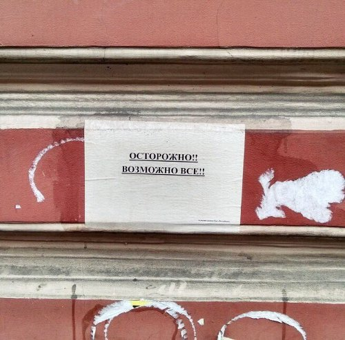
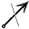

# 12 архетипов и 4 экзистенциальных страха связаны! Экзистенциально-Архетипическая Теория и Типология

Вы наверняка много думали о том, насколько всё взаимосвязано. :)

Вот сейчас мы увидим, что [12 архетипов](http://realfaq.org/discussion/11907/12-arhetipov/p1) (большинству архетипы известны не из Юнга, а из книги Марк и Пирсон) напрямую уходят корнями в [экзистенциальные страхи][1] (описанные Ирвином Яломом).

И не просто увидим. Вы сможете в рамках этого как следует (а может даже и как не следует) оттипировать себя и окружающих! Потому, что получившийся синтез — это еще и типология.

Для начала — об экзистенциальных страхах. Если вы о них знаете — можете описательную часть пропустить, и сразу перейти к части «[Агрегатные состояния экзистенциальных страхов][2]«.

## У экзистенциального страха глаза велики

Интересуетесь психологией, но не слышали про экзистенциальные страхи?..

Тогда обязательно прочитайте книгу Ирвина Ялома [«Экзистенциальная психотерапия»][3]. Потому, что это — краеугольный камень всей работающей психологии, без которого ваш интерес приведет в никуда.

Я серьезно. Практически все наши психологические проблемы уходят корнями именно туда — в экзистенциалку.

Многих вводит в заблуждение слово «страхи». «Страх» в нашем понимании означает, что мы чего-то боимся. И так и ощущаем это — что нам в буквальном смысле страшно.

«Да не боюсь я никакой бессмысленности» — скажет человек, — «Чего тут пугаться-то?..»

Но дело в том, что, чтобы ощутить экзистенциальные страхи в первозданной форме — они, как минимум, должны быть осознаны. А экзистенциальные страхи пугают нас до такой степени, что обычно вытеснены, рационализированы, скомпенсированы и т.п. — в общем, покрыты толстенным слоем психологических защит.

Если, например, спросить у человека, боится ли он смерти, ответы могут быть самые причудливые. Часто люди говорят, что боятся боли, которая может быть в преддверии смерти, а самой смерти — нет. Но это — не о том. Иногда говорят, что боятся смерти близких, а своей — нет. Но и это — не совсем о том. Иногда отвечают, что не боятся, ведь их не будет — а кому тогда бояться. Верующие убеждают себя, что со смертью жизнь не заканчивается.

В общем, правда зачастую становится видна только в самолете во время сильной турбулентности. Да и там — далеко не у всех.

Ужас того, что то, чем мы в этой жизни являемся (и что думает, чувствует, осознает все происходящее, ЖИВЕТ), прекратит свое существование, человеческим сознанием всячески обходится.

То же самое касается страха бессмысленности, свободы и изоляции (одиночества). Именно как «страхи» экзистенциальные страхи ощущаются достаточно редко. Это может быть что угодно — но по итогу оно все равно о страхе. Таком сильном, что сознание его блокирует.

Потому я и говорю, что экзистенциалка — краеугольный камень психологии. При том, что люди с психологическим образованием иногда с экзистенциальной психотерапией даже не знакомы. О, эти причуды психологического образования, столь же беспощадного, сколь и бессмысленного! 

Кстати, страх бессмысленности, как я упомянул, как раз входит в число экзистенциальных страхов. И страх беспощадности — тоже, только называется он иначе. 🙂

Сильно углубляться в экзистенциальные страхи мы не будем — лучше почитайте книгу Ялома. Пройдемся вкратце.

### Страх Одиночества (Изоляции)

Что, если по большому счету всем на тебя наплевать? И никто не поставит твои интересы превыше своих собственных, если они вступят в конфликт?

Что, если никто не станет бесконечно терпеть, любить и поддерживать тебя таким, как ты есть? А будет делать это только до тех пор, пока ты будешь им удобен?..

Что, если не существует [вечной любви, по-настоящему надежной крепкой дружбы](https://ivaness.com/lyubov-ili-druzhba-chto-vazhnee/) безо всяких условий?

А может любое взаимопонимание и близость — вообще иллюзия наших умов? И по-настоящему тебя никто никогда не поймет? 

И какими бы друзьями и связями ты не обзаводился, какая бы большая у тебя ни была семья — подыхать тебе все равно в одиночестве, даже если вокруг будет стоять толпа друзей и близких?.. Ведь никто из них не разделит с тобой твою смерть — точно так же, как, по сути, не делил и жизнь, даже находясь рядом.

Что, если в этом мире ты совершенно одинок?..

Страх Изоляции мы будем обозначать вот таким символическим значком одиночной камеры.

В том смысле, что где и с кем бы ты ни был — глобально ты все равно один, и стены изоляции друг от друга не разрушить.

### Страх Свободы

А вдруг мир никак не устроен? Вдруг высшей справедливости нет? Кармы нет? Возмездия нет? И можно делать всё, что угодно? 

Но и с тобой может произойти что угодно. Потому, что стабильности тоже нет. 

И гарантий чего-либо нет — потому, что всё контролировать невозможно. И не существует никакой системы знаний о мире, которая бы это позволила. 

Может быть судьба слепа и беспощадна?..

Страх Свободы мы будем обозначать вот такой «снежинкой» или «розой ветров». Которая на самом деле — вовсе не снежинка, и даже не роза ветров — а множество направлений, в которых можно двигаться.

Не существует камня с указателями «направо пойдешь — коня потеряешь, налево пойдешь — сам пропадешь». Двигаться можно куда угодно. И произойти там с тобой может что угодно. В любой момент.

### Страх Бессмысленности

А вдруг у твоей жизни нет никакого смысла? Вдруг она не имеет никакой миссии, и вообще ничего не значит?

Может ты — просто часть человечества, как биологического вида, и ничего больше? А вся твоя задача — это подрасти, размножиться, состариться и сдохнуть? Как и у твоих предков и потомков? 

А может, даже если ты не размножишься — то и это почти ни на что в мире не повлияет? Может и само существования человечества никакой цели, кроме просто существования, не имеет? 

Может твоя уникальная внутренняя жизнь никому ни для чего не нужна. А все твои глубокие мысли, чувства и переживания — просто побочные эффекты работы мозга, когда он не занят основной биологической программой.

Что, если ты здесь — просто так, ни за чем?

Страх Бессмысленности мы будем обозначать перечеркнутым вектором:

Типа, no way — чего-то глобального, к чему можно было бы стремиться, может просто не существовать.

### Страх Смерти

А вдруг, когда ты умрешь — тебя не будет? Совсем. Нигде и никогда.

Если ты атеист — тебе этого объяснять не надо. 

Но даже если ты верующий — странно было бы думать, что душа твоя после смерти останется чем-то обособленным и сохранит свое умственное сознание. А не вольется в единое целое, перестав себя осознавать. 

И это будешь уже совсем не ты. Того, чем ты являешься сейчас, твоего нынешнего самоосознающего сознания уже никогда и нигде не будет — ТЫ перестанешь существовать. Навсегда. И больше — никогда.

Как тебе такая мысль?

Страх Смерти мы будем обозначать просто — могилкой.

Был человек — и нет человека.

## «Агрегатные состояния» экзистенциальных страхов

Мы предлагаем такое деление (как позже оказалось — не мы одни: о похожем уже писал, например, [Джордж Дворский](http://realfaq.ru/discussion/12448/kak-preodolet-ekzistencialnyy-krizis)). Каждый экзистенциальный страх у человека может быть:

**Вытеснен**. Это означает, что факт наличия страха мы отрицаем, и не видим его у себя в принципе. «Умереть — далеко не самое страшное, что может случиться в жизни!» и т.п. 

Это и следующее «агрегатные состояния» экзистенциальных страхов — потенциально очень холиварны. Люди зачастую агрессивно отстаивают перед другими свое право вытеснять или компенсировать.

**Скомпенсирован неосознанно (гиперкомпенсирован)**. Страх в данном случае есть, но он неосознанно компенсируется. По сути — отрицается существование источника страха, и этому подчиняется часть собственных действий и убеждений. 

Именно на такое направлены любые верования. 

«Где-то есть моя «вторая половинка», «родная душа» («мои» люди, «мой» коллектив), которая меня полностью примет, поймет, и разделит все мои чаяния — просто я ее пока не встретил!» (Одиночества нет). 

«Судьба ведет меня, нужно только правильно трактовать ее знаки (варианты: меня охраняет ангел-хранитель, или даже вообще всё предопределено заранее). Если произошло что-то плохое — значит я просто сделал что-то не так, и если пойму — что, то этого не повторится! Каждому за все воздастся, ничто не проходит незамеченным, справедливость всегда торжествует. Плохие поступки портят карму и всегда аукаются!» (Свободы нет). 

«В моей жизни есть смысл, и я его найду — перечитав кучу литературы, уехав путешествовать за тридевять земель от дома, бесконечно медитируя — но найду!» (Бессмысленности нет). 

«Я знаю, что душа — бессмертна, и значит я не умру!» (Смерти нет).

**Осознан**. Тут собственно всё понятно. Мы осознали страх, и он причиняет нам страдания. 

Мы знаем, что можем оказаться в ситуации, когда никто нас не поддержит. 

Что, как бы мы ни пытались контролировать жизнь, с нами в любой момент может произойти всё, что угодно. 

Что смысла в жизни нет. 

Что мы умрем. 

Это — самое болезненное агрегатное состояние для экзистенциального страха, но именно это — наиболее конструктивная точка роста. Я знаю людей, у которых осознаны даже все четыре экзистенциальных страха. Жизнь у них непростая. 

Здесь **компенсация тоже возможна**, но, в отличие от предыдущего случая — **сознательная**. 

Например, из страха Смерти мы можем стремиться по-максимуму создавать что-то такое, что оставит о нас память «в веках», и тем самым как бы «продлит» наше существование. 

Из страха Бессмысленности — заполнять свою жизнь непрерывными событиями, чтобы не было времени задуматься о тщете бытия. 

Из страха Свободы — маниакально пытаться контролировать все вокруг. И т. п.

**Проработан**. Да, представьте себе, такое тоже бывает. Обычно это происходит после длительного нахождения в предыдущей фазе, как итог осмысления и принятия. 

«Абсолютной близости не существует, по большому счету взаимопонимание — лишь иллюзии наших умов. Люди с нами до тех пор, пока мы их устраиваем по ряду условий. Это жизнь, она так устроена, я принимаю это, и это не мешает мне дружить и любить». 

«Со мной в любой момент может произойти всё, что угодно. Мир — это хаос. Но осознание этого не мешает мне строить свой собственный маленький порядок в своей жизни, даже несмотря на то, что он в любой момент может быть разрушен».

«Смысла у моей жизни нет, я с этим смирился, и сам ищу себе маленькие локальные смыслы, позволяющие жить дальше.» 

«Да я умру, это — очень плохо, но это — данность. Постараюсь использовать каждый момент жизни на всю катушку».

Собственно, этими фазами («агрегатными состояними») и определяется тип по Экзистенциально-Архетипической Типологии (ЭАТ).

Записывать его мы будем так: сверху — экзистенциальные страхи, снизу, под каждым — то, в каком состоянии находится этот страх у человека в данный момент.

Из словосочетания «в данный момент» понятно, что тип в течение жизни может меняться. Все мы переживаем экзистенциальные кризисы — и вытесняем, осознаем, компенсируем и прорабатываем те или иные страхи. Однако меняется он не очень быстро. В большинстве случаев проработка проблематики того или иного экзистенциального страха исчисляется годами.

Вот, например, мой тип на текущий момент:

<table>
  <tr>
    <td class="has-text-align-center" data-align="center">
      
    </td>
    
    <td class="has-text-align-center" data-align="center">
      
    </td>
    
    <td class="has-text-align-center" data-align="center">
      
    </td>
    
    <td class="has-text-align-center" data-align="center">
      
    </td>
  </tr>
  
  <tr>
    <td class="has-text-align-center" data-align="center">
      
    </td>
    
    <td class="has-text-align-center" data-align="center">
      
    </td>
    
    <td class="has-text-align-center" data-align="center">
      
    </td>
    
    <td class="has-text-align-center" data-align="center">
      
    </td>
  </tr>
</table> 

А вот так выглядит нынешний тип другого автора ЭАТ — Валентины:

<table>
  <tr>
    <td class="has-text-align-center" data-align="center">
      
    </td>
    
    <td class="has-text-align-center" data-align="center">
      
    </td>
    
    <td class="has-text-align-center" data-align="center">
      
    </td>
    
    <td class="has-text-align-center" data-align="center">
      
    </td>
  </tr>
  
  <tr>
    <td class="has-text-align-center" data-align="center">
      
    </td>
    
    <td class="has-text-align-center" data-align="center">
      
    </td>
    
    <td class="has-text-align-center" data-align="center">
      
    </td>
    
    <td class="has-text-align-center" data-align="center">
      
    </td>
  </tr>
</table> 

Порядок страхов зададим фиксированный: Изоляции, Свободы, Бессмысленности, Смерти. Почему именно такой — дальше поймете.

Если этот порядок запомнить — то при сокращенной записи типа значки страхов можно будет не рисовать, указывая только «агрегатное состояние» каждого страха.

Тогда мой тип (Ivanes$) будет записываться так:

<table>
  <tr>
    <td>
      
    </td>
    
    <td>
      
    </td>
    
    <td>
      
    </td>
    
    <td>
      
    </td>
  </tr>
</table> 

А тип второго автора типологии (Valchonok) — вот так:

<table>
  <tr>
    <td>
      
    </td>
    
    <td>
      
    </td>
    
    <td>
      
    </td>
    
    <td>
      
    </td>
  </tr>
</table> 

А у вас что, дорогие читатели?.. Типируйтесь на здоровье! 🙂

Почему же типология — не просто Экзистенциальная, а Экзистенциально-Архетипическая?.. А вот читайте дальше!

## 12 архетипов

[Архетипы](http://realfaq.ru/discussion/12441/arhetipy-kratko) — это те интегральные образы, которые «впечатаны» в коллективное бессознательное, и по которым мы, зачастую — даже не осознавая этого, сходу идентифицируем новых людей, происходящее, и информацию в целом.

Цитируя автора, работы которого мы дальше рассмотрим подробнее:

<blockquote class="wp-block-quote is-style-quote is-layout-flow wp-block-quote-is-layout-flow">
  

    «Архетип — это всего-то навсего аналог актерского амплуа, но не для театральных ролей, а для жизненных. То есть — понятие, собирающее в себя некую группу жизненных ролей, объединенных одной общей для них всех функцией.
  

  
  

    И, как в актерском театральном амплуа собираются роли из пьес разных авторов, живших в разное время и в разных странах, писавших на разных языках про жизнь и отношения разных людей, так и в архетипе собираются жизненные сюжеты и коллизии, объединенные одной функцией, которая по разному проявляет себя в разных условиях и обстоятельствах».
  

  
  <cite>О. Книзе</cite>
</blockquote>

Углубляться в причины существования архетипов мы здесь не будем, поскольку об этом и без нас написан целый ряд материалов.

Из классики про архетипы лучше всего, конечно, читать Карла Густава Юнга: «Архетип и символ», «Структура психики и архетипы», «Душа и миф. Шесть архетипов».

Но мы здесь будем рассматривать то, как 12 архетипов описаны в книге Маргарет Марк и Кэрол Пирсон «[Герой и бунтарь. Создание бренда с помощью архетипов](http://realfaq.ru/uploads/geroj-i-buntar-sozdanie-brenda-s-pomoschyu-arhetipov-margaret-mark-kerol-pirson.pdf)» и в проекте Ольге Книзе (Knjazna), которую многие знают как автора [типологии Нелюдей](http://realfaq.ru/categories/tipologiya-nelyudej).

В книге Марк и Пирсон 12 архетипов рассматриваются в первую очередь с точки зрения позиционирования бренда. В текстах Ольги Книзе — с социально-психологического ракурса, причем — именно в российской действительности.

Последнее — как раз то, что нам нужно. Поэтому на проекте Княжны и ее коллеги Dreamer-M и остановимся подробнее.

Вводные тексты Княжны и Dreamer-M:

  - 
    [Предисловие. История встречи](http://realfaq.ru/discussion/14081/arhetipy-istoriya-vstrechi-predislovie-knjazna)
  
  - 
    [Архетипы, бренды и имидж](http://realfaq.ru/discussion/14082/arhetipy-brendy-i-imidzh-k-chertu-podrobnosti-kakaya-galaktika-knjazna)
  
  - 
    [Архетипы: функционал. Большой рассказ про маленький выпавший винтик](http://realfaq.ru/discussion/14083/arhetipy-funkcional-bolshoy-rasskaz-pro-malenkiy-vypavshiy-vintik-knjazna)
  
  - 
    [Архетип: как это работает](http://realfaq.ru/discussion/14084/arhetip-kak-eto-rabotaet)
  
  - 
    [Архетип в сказочном сюжете](//dreamer-m.livejournal.com/400148.html)
  
  - 
    [Чем заняться в сказке](//dreamer-m.livejournal.com/400496.html)
  
  - 
    [Архетипы, времена и нравы](//dreamer-m.livejournal.com/400721.html)
  

Сами 12 архетипов. Сначала идет описание Княжны, в скобках, по ссылке «в сказке», описание от Dreamer-M:

Вектор интересов: **Принадлежность** (Люди/Принадлежность — _Марк и Пирсон_):

  - 
    [Свой парень (Славный малый)](http://realfaq.ru/discussion/comment/116531/#Comment_116531) ([в сказке](//dreamer-m.livejournal.com/400991.html))
  
  - 
    [Романтик (Любовник)](http://realfaq.ru/discussion/comment/116533/#Comment_116533) ([в сказке](//dreamer-m.livejournal.com/402086.html))
  
  - 
    [Шут](http://realfaq.ru/discussion/comment/116532/#Comment_116532) ([в сказке](//dreamer-m.livejournal.com/403206.html))
  

Вектор интересов: **Стабильность** (Стабильность/Структура — _Марк и Пирсон_):

  - 
    [Заботливый (Хранитель, Опекун)](http://realfaq.ru/discussion/comment/116574/#Comment_116574) ([в сказке](//dreamer-m.livejournal.com/401163.html))
  
  - 
    [Творец](http://realfaq.ru/discussion/comment/116573/#Comment_116573) ([в сказке](//dreamer-m.livejournal.com/402360.html))
  
  - 
    [Правитель](http://realfaq.ru/discussion/comment/116572/#Comment_116572) ([в сказке](//dreamer-m.livejournal.com/403877.html))
  

Вектор интересов: **Независимость** (Изучение/Индивидуальность — _Марк и Пирсон_):

  - 
    [Простодушный (Ребенок)](http://realfaq.ru/discussion/comment/116482/#Comment_116482) ([в сказке](//dreamer-m.livejournal.com/401645.html))
  
  - 
    [Искатель](http://realfaq.ru/discussion/comment/116489/#Comment_116489) ([в сказке](//dreamer-m.livejournal.com/402619.html))
  
  - 
    [Мудрец](http://realfaq.ru/discussion/comment/116491/#Comment_116491) ([в сказке](//dreamer-m.livejournal.com/404128.html))
  

Вектор интересов: **Мастерство** (Результаты/Мастерство — _Марк и Пирсон_):

  - 
    [Герой](http://realfaq.ru/discussion/comment/116490/#Comment_116490) ([в сказке](//dreamer-m.livejournal.com/401818.html))
  
  - 
    [Изгой (Аутло, Бунтарь)](http://realfaq.ru/discussion/comment/116529/#Comment_116529) ([в сказке](//dreamer-m.livejournal.com/402955.html))
  
  - 
    [Маг](http://realfaq.ru/discussion/comment/116527/#Comment_116527) ([в сказке](//dreamer-m.livejournal.com/404296.html))
  

Послесловия:

  - 
    [Послесловие Княжны. Архетип, личность, обличье](http://realfaq.ru/discussion/14085/arhetip-lichnost-obliche-posleslovie-knjazna/p1)
  
  - 
    [Послесловие Dreamer-M: архетипы и игры](//dreamer-m.livejournal.com/404490.html)
  
  - 
    [Постпослесловие Княжны. Архетип: по Проппу или по Берну?](http://realfaq.ru/discussion/14086/arhetip-po-proppu-ili-po-bernu-postposleslovie-knjazna/p1)
  
  - 
    [Постпослесловие Dreamer-M: архетипы, встроенные в жизнь](//dreamer-m.livejournal.com/404828.html)
  

Почитайте — проект очень интересный.

Но главное, на что нам здесь стоит обратить внимание — это что все архетипы поделены на так называемые векторы интересов (приоритетов). В рамках которых существуют младший, средний и старший архетип.

Согласно теории, человек способен продвигаться по архетипам, прорабатывая проблематику предыдущего архетипа и переходя в следующий. Продвигаться можно двумя путями: в рамках вектора и по глобальной общей спирали.

Впрочем, ничто при этом не мешает человеку вновь оказаться в более младшем архетипе — в зависимости от того, что в его жизни в данный момент актуально, и как сложатся условия и потребности.

Кроме того, по Княжне пребывание человека в том или ином архетипе может быть имитационным (когда мы пытаемся скопировать внешние признаки некоего образа) и с реальным полным погружением в роль. Особенно это касается архетипов, начиная с Изгоя и выше. Имитировать более ранние архетипы можно тоже, просто у этого чаще всего нет никаких вторичных выгод.

## Экзистенциально-Архетипическая Типология

Что здесь видим мы?

Если внимательно почитать про проблематику каждого архетипа, нетрудно обнаружить, что вектора интересов отлично коррелируют с… экзистенциальными страхами!

Следите за руками.

Вектор приоритетов «**Принадлежность**» подразумевает стремление принадлежать чему-то большему и быть высоко оцененным другими — экзистенциальный страх **Изоляции (Одиночества)**.

Вектор приоритетов «**Стабильность**» подразумевает желание безопасности, стремление справиться с окружающим хаосом и взять его под контроль — экзистенциальный страх **Свободы**.

Вектор приоритетов «**Независимость**» подразумевает поиск себя и ответов на свои вопросы — экзистенциальный страх **Бессмысленности**.

Вектор приоритетов «**Мастерство**» подразумевает попытку победить законы самой жизни — экзистенциальный страх **Смерти**.

Таким образом, архетипы соответствующего вектора по сути являются своего рода аватарами (сценическими костюмами, если угодно) для трех разных форм контакта с определенным экзистенциальным страхом.

Важно уточнить, что речь идет о реальном проживании проблематики архетипа с полным погружением. Иммитация любого архетипического образа и поведения представляется нам возможной при любой степени проработанности вектора и любом состоянии экзистенциального страха.

## Опорные точки массового сознания _(Update от 31.12.2016)_

Если мы честно и без прикрас взглянем на то, что больше всего волнует людей — то обнаружим, что наиболее «заряженные» темы массового сознания таковы:

  - 
    Личные отношения, ceкc, семья, дружба и т.д.
  
  - 
    Деньги, благосостояние, успешность на материальном плане
  
  - 
    Самореализация, смысл жизни, поиски себя и высших истин
  
  - 
    Здоровье и выживание
  

Чуть ли ни все основные интересы, заботы, радости и тревоги человечества так или иначе укладываются в эти обобщенные группы. Чтобы убедиться — можно прямо открыть интернет, и каждый попавшийся материал, мотивирующий к чему-либо или решающий какую-либо проблему, классифицировать по этим четырем направлениям. Иногда они пересекаются.

Причем людей, реально достигших значительных успехов по какому-либо из этих направлений — единицы, а универсальных рабочих алгоритмов, позволяющих серьезно продвинуться в этих вопросах — нет, и их каждый вынужден искать для себя самостоятельно.

Здоровье и выживание, правда, начинает беспокоить людей только тогда, когда с этим возникают проблемы. Но зато всё остальное из перечисленного тогда уже отходит на второй план.

Ничего не напоминает?..

Именно! Экзистенциальные страхи и вектора архетипов!

  - 
    Личные отношения, ceкc, семья, дружба — страх Изоляции, вектор Принадлежности
  
  - 
    Деньги, благосостояние, успешность на материальном плане- страх Свободы, вектор Стабильности
  
  - 
    Самореализация, смысл жизни, поиски себя и высших истин — страх Бессмысленности, вектор Независимости
  
  - 
    Здоровье и выживание — страх Смерти, вектор Мастерства
  

## Гипотезы об 12 архетипах, экзистенциальных страхах и опорних точках массового сознания

**Страх вытеснен**. В этом случае проблематика вектора для нас не актуальна вообще, либо актуален младший архетип вектора (находится в активной острой фазе).

**Страх неосознанно скомпенсирован**. Проблематика младшего архетипа вектора проработана (знакома и человек чувствует себя в этой роли уверенно), среднего — актуальна (в обостренной стадии) на данный момент или отвергается.

**Страх осознан**. Проработана проблематика среднего архетипа вектора, проблематика старшего отвергается, либо находится в острой актуальной стадии.

**Страх проработан**. В этом случае у нас проработана проблематика старшего архетипа вектора — человек чувствует себя в этой роли уверенно и комфортно.  

**_Update от 31.12.2016:_**

Еще гипотеза: Определять актуальность и проработанность экзистенциальных страхов и архетипических векторов также можно, опираясь на установки, заряды и позиции человека по вопросам:

  - 
    человеческих взаимоотношений (страх Изоляции, вектор Принадлежности)
  
  - 
    денег, благосостояния (страх Свободы, вектор Стабильности)
  
  - 
    самореализации, поиски себя, смысла жизни и высших истин (страх Бессмысленности, вектор Независимости)
  
  - 
    здоровья (страх Смерти, вектор Мастерства)
  

Способ диагностики гипотетически начинается с выявления: если тема Вас беспокоит — это «стрелочки» (вверх или вниз), если не беспокоит — «галочка» или «крестик». Дальше необходим углубленный анализ.

И еще гипотеза: **достижение существенных результатов в этих наиболее актуальных для человека областях впрямую зависит от уровня проработанности соответствующих экзистенциальных страхов (и, соответственно, архетипических векторов)**.

Все данные гипотезы нуждаются в проверке. Возможно, в дальнейшем они позволят определять, в каком состоянии у человека находится тот или иной экзистенциальный страх, на основе проявленности архетипов. Этим мы Вам и предлагаем заняться — проверить на себе.

Определите свой тип по Экзистенциально-Архетипической Типологии (только будьте с собой честны!).

Подумайте о своем отношении к деньгам, взаимоотношениям, самореализации и поискам смысла, здоровью. 

Прочитайте про 12 архетипов, и постарайтесь понять, проблематика каких архетипов для вас на данный момент особенно актуальна. 

Разместить свой ответ можно у себя во ВКонтакте или Фейсбуке с хэш-тегом **#ЭАТ** — тогда мы сможем вас по нему найти.

## Где можно обсудить Экзистенциально-Архетипическую Теорию?

Есть группа ВКонтакте «[Экзистенциальные страхи и 12 архетипов](https://vk.com/existarch)» (сокращенно «ЭкзистАрх»), где мы собираем полезные материалы по архетипам и экзистенциалке.

На форуме «FAQ по реальности» существует целый раздел «[Экзистенциально-Архетипическая Типология](http://realfaq.ru/categories/ekzistencialno-arhetipicheskaya-tipologiya)«.

Приглашаем присоединиться к исследованию!

_Авторы Экзистенциально-Архетипической Теории (ЭАТ): [Валентина Valchonok](//vk.com/valchonok)_, _[Павел Ivanes$][4]_

 [1]: https://ivaness.com/ekzistencialnye-strahi/
 [2]: #agregatnye-sostoyaniya-ekzistentsialnyh-strahov
 [3]: http://realfaq.ru/uploads/irvin-yalom-ekzistencialnaya-psihoterapiya.doc
 [4]: /me/

