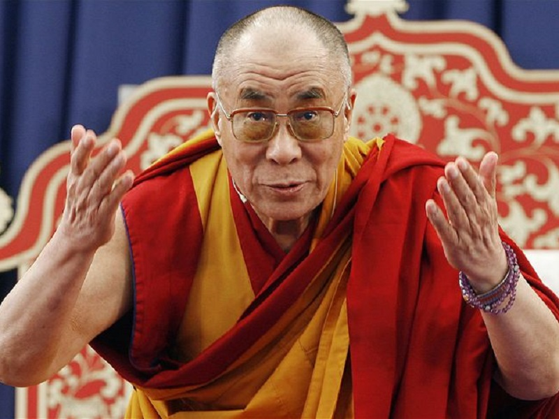
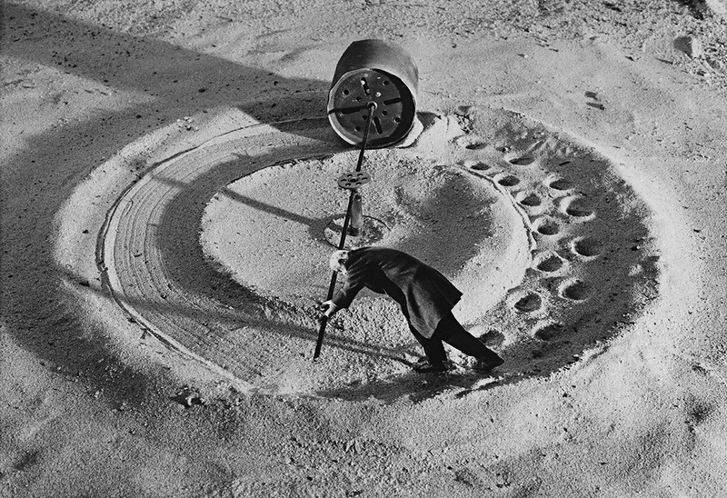
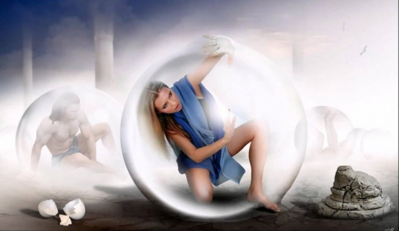
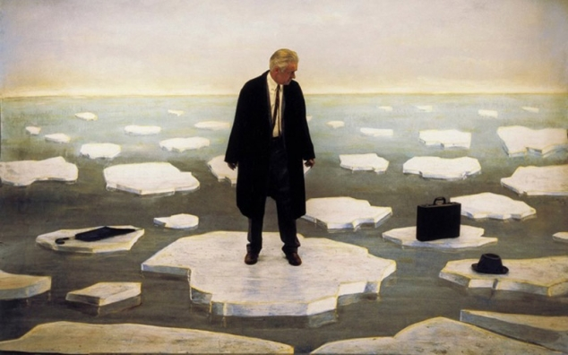
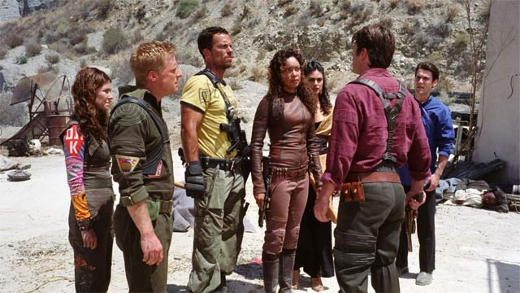

# Экзистенциальные страхи — это как? Мой опыт

 

О том, что такое 4 экзистенциальных страха (страх Бессмысленности, страх Одиночества, страх Свободы, страх Смерти), я [уже писал](https://ivaness.com/12-arhetipov-i-ekzistencialnye-strahi/). И ссылку на книгу Ирвина Ялома «Экзистенциальная психотерапия» тоже давал.

О том, что именно экзистенциальные страхи побуждают людей так хотеть отношений, денег, здоровья и самореализации (самых заряженных в социуме тем), вы, думаю, тоже знаете.

Но всё же напомню, что, с моей точки зрения, вообще **все наши мотивы** диктуются 4 экзистенциальными страхами.

Чем бы мы ни занимались, мы в итоге посредством этого:

  - 
    ищем партнёров в личной жизни и друзей;
  
  - 
    ищем смысл существования;
  
  - 
    ищем возможность управлять происходящим и ресурсы для этого;
  
  - 
    ищем возможность справиться с конечностью жизни.
  

Здесь же хочу рассказать про собственный экзистенциальный опыт простыми словами.

Проработка экзистенциальных векторов (я намеренно заменил слово «страхи», чтоб не привязывать их к понятию «бояться» — ибо это часто порождает путаницу у людей, с психологией не знакомых — мол, да не боюсь я этого) чаще всего занимает у человека всю жизнь. Именно потому, что никаких других игр, кроме этих четырех, наша жизнь, по сути, и не предусматривает.

Допускаю, что существуют полностью просветленные люди, проработавшие все четыре экзистенциально-архетипических вектора. Возможно, например, что таков нынешний Далай-Лама, на чью долю выпала очень напряженная и тяжелая судьба, в результате которой он стал тем, кем стал.

Однако даже они, скорее всего, просто переходят на отработку того же самого, но уже на трансперсональном уровне. Раньше проблематика была значима применительно к собственной жизни — теперь беспокоит на уровне судьб человечества.

Проработается на уровне человечества — перейдет еще куда-то. И так далее, по спирали. Ибо просто ну нету у жизни других игр, которые она могла бы нам предложить. 🙂

Иногда люди в течение жизни понемногу играют то в одно, то в другое. Иногда — всю жизнь оттачивают мастерство в одной и той же игре, часто даже — в одном и том же архетипе.

Но лично у меня почему-то экзистенциальные кризисы в жизни выстраиваются как-то прям последовательно. Словно стоят в очереди, и когда ты закончил дела с одним — напротив тебя сразу же садится в кресло следующий.

И я об этом сейчас расскажу. А вы рассказывайте, как у вас.

## Экзистенциальный страх Бессмысленности {#экзистенциальный-страх-бессмысленности.wp-block-heading}

В юности меня крыло именно страхом Бессмысленности жизни.

Даже, нет, тема смысла собственной жизни вышла на первый план чуть ли ни в отрочестве. К 18 годам она достигла пика.

В те времена я читал Германа Гессе, а в моем сознании постоянно присутствовала мысль о недемонстративном суициде.

Наверное в юности что-то подобное бывает у многих — просто связано оно с разными экзистенциальными векторами. Мною суицидальные мысли воспринимались именно как способ решения вопроса бессмысленности жизни. В духе: зачем жить, если нет смысла.

Однако и верить в бессмысленность я был явно не готов — наоборот, постоянно искал и искал. А тех, кто о смысле собственного существования не задумывается, с юношеским максимализмом считал, мягко говоря, недалекими.

В поисках прошло еще несколько лет. Довольно много лет, если честно.

А дальше я не знаю, что произошло. Сейчас могу лишь сделать предположение исходя из нынешнего опыта: когда напряжение от неспособности переносить экзистенциальный кризис нарастает настолько, что становится просто невыносимым — что-то схлопывается.

Было это уже под конец третьего десятка.

Я вдруг понял — нет, скорее ощутил на прямом опыте — что совершенно неважно, есть у жизни смысл, или нет. И у моей жизни — в частности.

Позже я много раз пытался сформулировать это в словах — но на ментальном уровне передать это другому человеку, к сожалению, не получается.

По большому счету, оно близко к известному анекдоту про солонку:

<blockquote class="wp-block-quote is-style-quote is-layout-flow wp-block-quote-is-layout-flow">
  

    Умер человек и спрашивает ангела:
  

  
  

    — В чём был смысл моей жизни?
  

  
  

    — А помнишь как ты поехал на курорт и пошёл обедать в вагон ресторан?
  

  
  

    — Да вроде помню.
  

  
  

    — А за соседним столиком сидела женщина и она попросила тебя передать соль?
  

  
  

    — И что?
  

  
  

    — И ты передал.
  

  
  

    — Так а в чём был смысл моей жизни?
  

  
  

    — Вот.
  

  
  <cite><em>анекдот</em></cite>
</blockquote>

Суть в том, что смысл ищет наш ум, наша личность.

Предположим, что у нашей жизни есть смысл. 

Закономерно, что смысл этот лежит не в плоскости ума, а вне системы, вне внутренних задач, которые кажутся актуальными нашему уму. Смысл любой детали — не внутри детали, а в той функции, которую она выполняет в общем механизме.

Допустим, наша задача в том, чтобы своим существование производить максимальное количество некоей субстстанции. Например — энергоинформационного материала на корм следующему звену пищевой цепочки — эгрегорам.

Если мы узнаем этот смысл — удовлетворимся ли мы этим ответом, и посвятим ли свою жизнь тому, чтобы производить максимум этой субстанции наилучшим образом?..

Скорее всего — нет. Наш ум, нашу личность, такой «смысл жизни» не устроит. Потому, что ум хочет смысл существования себя самого, а не нас в целом. Хочет, чтобы ему от этого смысла стало хорошо.

Но ум, личность, то, что мы привыкли считать собой — это лишь часть нас. Причем живет-то — не она. Она лишь осмысливает происходящее и пытается взять его под контроль. И в этом — ее единственный «смысл».

В общем, для личности мы можем сами придумать себе любой смысл, и делать вид, что занимаемся его реализацией. Это совершенно неважно для жизни в целом, но успокоит ум. А подлинный смысл нашей жизни, даже если он есть, уму все равно не подойдет. Ибо кризис бессмысленности никак не решает.

Не знаю, насколько понятно передал. Облекать инсайты в слова — дело неблагодарное. С высокой вероятностью поймут только те, кто уже и так прожил это в себе. А им вроде как и передавать что-то без надобности. 🙂 В любом случае, экзистенциалка извне вряд ли разруливается, это — сугубо внутренняя забава.

Интересно, что все мои дальнейшие изыскания и путешествия были уже скорее финальным штрихом к этому пониманию, нежели какими-то открытиями. Просто очень уж комфортно мне в архетипах этого вектора (это вектор Независимости).

По сути, [концепция «Реальность»][1], появившаяся сильно позже, есть своего рода олицетворение моей проработки страха Бессмысленности. Любые знания о мире как бы перестали быть носителями смыслов и истины, и стали игрой. Стеклышками-призмами в калейдоскопе, способными сложиться в бесконечное многообразие узоров.

Путешествия же для меня в первую очередь оказались про общение, а не про поиск — так что в них я куда больше отрабатывал уже следующий вектор — Принадлежность. Ибо ближе к тридцати обострился кризис страха Одиночества (Изоляции). Но об этом — дальше.

А как со страхом бессмысленности жизни у вас?..

## Экзистенциальный страх Одиночества (Изоляции) {#экзистенциальный-страх-одиночества-изоляции.wp-block-heading}

А ближе к тридцати наступил кризис страха Одиночества (Изоляции).

Начался он, видимо, еще в период брака, но в полную силу заработал после развода.

Развод был тяжелым сам по себе, а учитывая попытки как-то поделить друзей и знакомых, многие из которых были мне очень дороги, но волей или неволей вынужденно оказались на какой-то стороне — ничего удивительного, что накрыло не на шутку.

Вопрос о том, а нужен ли я вообще кому-то сам по себе, такой, как есть — моя суть, а не мои поступки, отношение и поведение — встал в центр моего существования.

Мне казалось, что друзья поддерживают недостаточно, что женщинам я нужен только на определенных условиях, и, главное, искренне возмущало то, что даже из тех, на кого я, как всегда считал, могу полностью положиться, никто не готов терпеть любые мои выверты и любить несмотря ни на что.

Что я вытворял, чтобы это проверить и подтвердить эти свои мрачные предположения — лучше не рассказывать. 🙂

Скажу лишь две вещи.

Большое спасибо тем, кто меня в те годы поддержал, и был рядом во что бы то ни стало. Люблю вас. Можете на меня рассчитывать.

И я прощаю тех, кто в тот период от меня отвернулся. Я понимаю ваши мотивы. Люблю и вас тоже. Несмотря ни на что.

Основной расколбас в те времена ощущался между полярностями: «Раз вы, гады такие, не любите меня безусловно — то просто не оставляете выбора, кроме как вами манипулировать. А ведь я хочу не манипулировать, а чтоб меня любили!»

Думая в таком ракурсе, можно было чуть ли ни любое свое проявление к кому-то хорошего отношения ощущать, как лицемерие. Представляете мое состояние?..

Потому, что одновременно я начал видеть механизм того, как вообще строятся отношения между людьми — но совершенно не готов был принять его циничную простоту и очевидность.

То, что симпатии у людей вызывает тот, кто говорит и делает им хорошее. А антипатии — наоборот. То, что приятные проявления нравятся, а неприятные вызывают непрязнь. То, как все это накладывается на механизмы компенсации личностных травм — которые в ряде случаев и определяют, что данному конкретному индивиду приятно, а что — нет.

И, главное, то, насколько простой цепочкой выстраивается у человека в голове, наделяется глубоким сакральным смыслом, и затем работает (и еще как!) система ментальных и эмоциональных зарядов, приводящая к любви или ненависти, дружбе или вражде, очарованности или пренебрежению.

При каждой коммуникации, или просто наблюденим за возникновением, развитием, или ходом чьих-то отношений, все эти цепочки вставали у меня перед глазами отчетливо, как зеленые столбики цифр у вышедшего из матрицы Нео. Только в данном случае это была «матрица» человеческих взаимоотношений.

Было ужасно понимать, как легко можно было бы этим управлять, не имея чувств самому. И как сложно это делать, когда сам ты — тоже живой человек, с такими же механизмами у себя внутри.

Именно эта примитивная предсказуемая механистичность и причинно-следственность человеческих взаимоотношений была для меня в тот период совершенно невыносима.

Когда по вектору «Принадлежность» делаешь этот шаг из архетипа «Романтик» в проработку архетипа «Шут» — это по-настоящему больно. Не зря образ Шута всегда рисуется с оттенком горечи. Осознание жуткой циничной простоты людских отношений — вот, что скрыто в печальных морщинках мудрых шутовских глаз.

И опять, когда невыносимость осознания достигает пика — всё вдруг схлопывается.

Я просто принял это как данность. Снова — не умом, а как инсайт, прямой опыт.

Да, всё вот так просто. И рассчитывать на то, что кто-то будет любить тебя, каким бы ты ни был, и что бы ты ни делал — глупо. А если даже кто-то будет — то это тем более не признак здоровых отношений и психики. Ибо даже мама — и та не станет от любимого ребенка терпеть что угодно. Многое, но не всё.

Да, мы приходим в мир одни. А уходим из него еще более одни — даже если нас держит за руки куча детей и внуков. Ведь, в конечном счете, каждому человеку он сам куда важнее, чем окружающие.

Это — данность. И она вовсе не мешает общаться, строить отношения, любить, дружить.

Попутно с принятием безграничности нашего одиночества, у меня тогда неожиданным бонусом проработалась неуверенность в своей привлекательности для противоположного пола, тянущаяся еще с подросткового возраста. И желание доказывать ее себе количеством связей (также известное как «Бивис, нам дадут!»).

Да, проработалась ближе к середине четвертого десятка. Но лучше поздно, чем никогда. 🙂

Помню, что произошло это после Камбоджи, в 2012. Но не благодаря тамошним азиатским девушкам, как вы могли подумать, а как раз благодаря нескольким романам с русскими женщинами. Признательность которым за нормализацию моей самооценки не имеет границ.

Я вдруг принял тот факт, что меня можно любить и хотеть. И что это — нормально. А не что захотеть меня может только какая-то редкостная извращенка, за которую, соответственно, надо хвататься только по факту этого, как за что-то уникальное.

Появилось чувство, что я могу выбирать, а не бросаться с жадной закомплексованностью на всё, что выбрало меня. Парадоксальным, но закономерным с точки зрения трансерфинга образом, вырос и сам выбор — ведь с вопроса снялась повышенная значимость.

И, главное — я понял, что близость с кем бы то ни было — она во мне, а не снаружи. Ведь ее создаю я сам. К дружбе, кстати, это тоже относится. Не отношения выбирают меня, а я сам — носитель и, соответственно, хозяин любых своих отношений.

В результате проблематика меня совершенно отпустила, построение и поддержание отношений на всех фронтах перешло в разряд сознательно нарабатываемых навыков, а заботить начали совсем другие вещи. Благодаря которым немедленно накрыл страх Свободы — вектор Стабильности. Но об этом — дальше.

А у вас как с экзистенциальным страхом Одиночества и архетипическим вектором Принадлежности?..

## Экзистенциальный страх Свободы (Неопределенности) {#экзистенциальный-страх-свободы-неопределенности.wp-block-heading}

Взаимоотношения с другими людьми и связанный с ними страх Изоляции, описанный в предыдущем посте — очень существенная часть жизни.

Поэтому неудивительно, что проработка этой темы по итогу породила во мне некоторое чувство контроля над происходящим. Возникла иллюзия — не на уровне ума, а где-то глубже — будто теперь я всегда понимаю, как поступить, чтобы добиться желаемого.

Кроме того, ближе к тридцати, совершив множество проб и ошибок, я начал наконец натыкаться на работающие методы, позволяющие улучшать качество жизни в самых разных ее сферах.

Подкрепленное ими, чувство власти над действительностью стало рости. Теперь у меня были инструменты улучшения жизни, и моя контролирующая субличность (которая только и ждала момента себя проявить) развернулась во всю ширь.

Экзистенциальный страх Свободы — это как раз о том, что может произойти всё, что угодно. Что есть вещи, которые от нас не зависят. Факторы, которые невозможно взять под контроль. Будет более понятно, если назвать его страхом **перед** свободой. Мне еще нравится называть его **страхом Неопределенности**.

Лейтмотивом существования постепенно стала непрерывная гонка за падающими — по счастью, пока не прямо на голову — непредсказуемыми кирпичами случайностей и не зависящих от меня обстоятельств. Которые становились тем изощреннее, и валились тем чаще, чем старательнее я пытался всё предусмотреть. И попытка на фоне этой гонки всё же куда-то двигаться и что-то строить.

Когда ты создаешь что-то, важное лично для тебя — а оно вдруг расширяется, и начинает включать в себя других людей, с которыми теперь, в рамках этого творения, нужно как-то обходиться, чтобы они не сломали творение, но и не сломались об него сами — это и есть переход из архетипа Творец в архетип Правитель по вектору Стабильность (согласно [Экзистенциально-Архетипической Теории](https://ivaness.com/12-arhetipov-i-ekzistencialnye-strahi/) он олицетворяет экзистенциальный страх Свободы).

Иногда в Правителя еще приходят по общей архетипической спирали — из Шута — когда берут на себя ответственность за что-то уже существующее, дабы пристроить на пользу дела накопленный коммуникативный опыт.

Меня же в «Правителя» вытолкнуло на стыке этих архетипов.

Поэтому закономерно, что именно в этот период я сделал свой портал в интернете. Точнее, возобновил — опыт с форумом был у меня и раньше, но сейчас это сопровождалось твердой решимостью развивать его во что бы то ни стало, даже если меня вообще никто не поддержит (страх Одиночества-то проработался).

Таким образом, желаемая картинка жизни внезапно распространилась не только на ближний круг, но и на всех тех, кто вместе со мной стал участниками форума. А сами эти участники мгновенно добавились к числу непредвиденных факторов и «падающих кирпичей».

Оказалось, что мир не хочет подчиняться и быть предсказуемым не только в неодушевленной своей части, а еще и в лице окружающих людей.

Масштаб «бедствия» разрастался, а вместе с ним росла и моя потребность держать происходящее под контролем. Всё вокруг ощущалось неустойчивым, нестабильным, и как будто рассыпалось прямо из-под рук. А те, на чью поддержку я рассчитывал, с завидной периодичностью норовили или переругаться между собой, или сунуть палку то в одно непонравившееся колесо, то в другое.

Приведу свой текст, который относится к финальной фазе данного периода, и всё станет ясно:

<blockquote class="wp-block-quote is-style-warning is-layout-flow wp-block-quote-is-layout-flow">
  

    Во времена наивной беззаботной юности мне представлялось, что управлять собственным проектом — это координировать единомышленников, которые симпатизируют друг другу, и делают общее дело, как единый хорошо смазанный механизм.
  

  
  

    А потом я посмотрел сериал «Firefly». Кто видел — помнит, что капитан Малкольм Рейнолдс, блистательно сыгранный Нэйтаном Филлионом, посвящает увлекательным приключениям, для которых создал свою команду, от силы 20% времени.
  

  
  

    Остальные 80% уходят на то, чтобы поддерживать порядок на корабле. Улаживать внутренние конфликты. Пытаться удержать команду в целости. Стыковать меж собой разнонаправленные интересы, разные системы ценностей, и просто склочные характеры участников. Подавлять бунты, иногда даже — угрожая выкинуть особо ретивых в открытый космос. А с кем-то — и расставаться, не сойдясь во взглядах, даже если многое связывает.
  

  
  

    «Боже, это что — вот так?..» — в ужасе думал я, сочувствуя капитану Малкольму, вынужденному ради своей мечты проводить столь огромную часть жизни в управленческих дрязгах, — «Это вот так происходит?..»
  

  
  

    Сейчас, спустя несколько лет существования портала «FAQ по реальности», я могу ответить себе совершенно точно. Да, парень. Так это и происходит. Именно так, мать вашу. 🙂
  

</blockquote>

Люди стали казаться нерадивыми, склочными и непоследовательными. Думающими только о собственных мелких интересах и проблемах, и не видящими дальше своего носа. Неспособными предвидеть и проконтролировать самые простые вещи.

Единственное, что оставалась — это носиться как угорелый, и со всех сторон подхватывать норовящие отвалиться детали той части мира, которую я назначил зоной своей ответственности. А ею оказывалось чуть ли ни всё, на что падал взгляд.

В общем, проблематика архетипа Правитель и вопросы ответственности, управления и контроля расцвели буйным цветом.

Надо сказать, авторитаризм и тиранию я в себе никогда не принимал и не признавал. И именно это было основной проблемой — поскольку их во мне всегда было более чем. 

А деспотичный сторонник демократии и коллегиальности — это примерно как гомофобный гей, отрицающий свои, всем вокруг очевидные, склонности.

Невозможно одновременно и пытаться держать все в своих руках, и ждать от окружающих предусмотрительности, сознательности и способности принимать разумные самостоятельные решения.

Мир устроен так, что, как только начинаешь тянуть на себя одеяло — люди тут же с радостью складывают его тебе в руки, и немедленно начинают во всех одеяльих изъянах винить именно тебя.

И это, в общем, оправданно. Ибо взялся — так решай проблемы.

Нервы у меня стали ни к черту, сон (раньше меня было из пушек не разбудить) — коротким и тревожным, а здоровье начало систематически давать всё более неприятные и разнообразные сбои.

В реале расклады былы не лучше, чем на форуме. Осознание того, что, несмотря на нечеловеческое напряжение, удержать под контролем все аспекты жизни не удаётся и, сколько бы я ни подкладывал соломки везде, где только можно, по-прежнему В ЛЮБОЙ МОМЕНТ МОЖЕТ ЧТО-НИБУДЬ СЛУЧИТЬСЯ, было настолько невыносимо, что словосочетание «экзистенциальный ужас» ни на секунду не казалось преувеличением.

В какой-то момент текущая ситуация словно нарочно сложились таким образом, что контролировать происходящее стало попросту невозможно.

Было это вдали от родины, обстоятельства очень плотно зажали тиски, не предоставив при этом никаких очевидных решений. Ежедневное «дожить до вечера без серьезных эксцессов» стало единственным способом что-то планировать, и целью, которую можно было себе ставить в сложившихся условиях. И единственным способом сохранить психику целостной.

Нет, конечно у меня и раньше случались в жизни передряги. Но тогда они происходили не на фоне отработки страха Свободы, и не воспринимались так остро и болезненно.

Когда всё закончилось, меня совершенно размазало. А обратно собралО уже, видимо, в немножко другую конфигурацию.

Сейчас не всё еще устаканилось с этим вектором, и частенько случаются флэшбэки. Но постепенно желание держать жизнь под контролем отступает, и делаю я это с меньшей эмоциональной вовлеченностью. А тот факт, что мы ни от чего не застрахованы, уже не вызывает невыносимого когнитивного диссонанса, и желания немедленно что-то с этим делать.

Самое сильное изменение, которое принесла в мою жизнь проработка страха Свободы — это, пожалуй, отношение к благам этого мира — материальным и нематериальным.

Вряд ли это можно счесть критерием проработки страха Свободы (точно так же, как, например, уверенность в собственной привлекательности не является признаком проработанности страха Одиночества — она может иметь место даже если страх не проработан), но для меня наиболее приятным бонусом оказалось именно это.

Я вдруг в полной мере понял, что в этом мире я — вовсе не гость (как казалось сорок лет до этого). Всё это — то, что вокруг — для меня. В том числе и самое лучшее.

Этот мир — он для нас, ребята. Все возможности, которые он предоставляет — не для соседа сверху, не для власть имущего, не для кого-то более красивого, талантливого, умного. Они — именно для ТЕБЯ.

Да, ты не можешь все контролировать, но можешь смело взять то, что тебе доступно.

Блага можно иметь, а возможностями пользоваться, не чувствуя себя ни не вправе, ни недостойным, ни посторонним. Ты здесь — хозяин, а не гость <s>тащи с работы каждый гвоздь (шутка)</s>. Ты достоин не просто бОльшего — а вообще всего, что сможешь получить. И единственные оправданные ограничения — законодательство и твои собственные моральные нормы. Больше — ничего.

Не только с нами может произойти всё, что угодно — мы сами тоже **свободны** брать от мира всё, что в нем есть. В этом и заключается подарок, который дарит нам столь нестабильная и хаотичная вселенная. И который мы иногда так упорно отказываемся принять.

Но я, опять-таки, не уверен, что это экзистенциальное переживание можно эффективно передать словами на уровне ума.

Когда я прочувствовал эту неограниченность внешнего ресурса — то страшнее всего оказалась конечность ресурса внутреннего. Но про накативший страх Смерти я попытаюсь рассказать дальше.

А как со страхом Свободы и вектором Стабильности у вас?..

### Свобода воли — есть или нет? А предопределенность? {#свобода-воли-есть-или-нет-а-предопределенность.wp-block-heading}

Когда писал про страх Свободы, забыл одну важную вещь.

К тому моменту, когда в моей жизни вдруг включилась активная проработка страха Свободы, я очень далеко отошел от любых теорий, приписывающих человеку некие фиксированные качества, которые что-то в его жизни определяют (как, например, [соционика](https://ivaness.com/kto-ja-v-socionike/)).

Их подход казался [неоправданным ограничением](https://ivaness.com/psihologicheskaya-tipologiya-klassifikaciya/).

Поэтому я активно я интересовался методиками, в которых личная ответственность за происходящее ставится во главу угла. Работой с подсознанием, например, и т.п.

Такого рода концепции декларируют, что все могут всё, что человек — полновластный хозяин своей судьбы, и что всё в его жизни зависит исключительно от него.

Да, несомненно, это — правда. Только правда эта — лишь одна сторона медали.

Подобные теории бьют в страх Свободы очень сильно.

Потому, что здесь ошибка может быть совершена в любой момент, она всегда — на тебе, и цена ее может быть сколь угодно высока. Что порождает огромное количество рефлексий по поводу каждого шага — как уже сделанного в прошлом («А вдруг это был не лучший выбор? Я ведь мог поступить иначе!»), так и того, который еще предстоит сделать («От моего ежесекундного выбора зависит вся моя дальнейшая жизнь!»).

Поэтому закономерно, что, когда страх Свободы актуализировался, качели моего сознания (видимо, в попытке компенсации) резко качнуло в другую крайность — начали интересовать теории, вроде Дизайна Человека, Генных Ключей, и даже астрологии.

Важная их особенность в том, что они наделяют человека определенными незыблемыми характеристиками, прямо или косвенно влияющими на его судьбу.

И — либо дают однозначный ориентир, следуя которому можно не испытывать сомнений, что делаешь всё «правильно» (как Стратегия и Авторитет в Human Design, которым можно «сдаться»).

Либо вообще утверждают (как астрология, например), что и проблематика твоя, и даже событийная сетка судьбы имеют элементы фиксированности. Которые можно узнать. А вот скорректировать — лишь в определенных доступных рамках.

Ирония в том, что теперь я знаю, что и эти теории — тоже правы.

И здесь нет противоречий.

Верно и то, что мы сами творим свою судьбу каждым своим шагом. И то, что есть стратегии, следуя которым можно не сомневаться. И даже то, что всё это предопределено.

Просто это всё — [разные проекции одной и той же реальности][1].

Невозможность узнать эту реальность во всей ее полноте как раз и активизирует страх Свободы. Который порождает желание уцепиться за какой-то однозначный подход в этом вопросе.

И каждый подход всегда будет встречать опровержения в применении к реальной действительности.

«Предопределёнщики» будут систематически сталкиваться с тем, что закономерности, которыми они пользуются, в ряде случаев не работают вообще. Что люди выходят за рамки теории, а порой и вообще совершают «невозможное», или даже являются этим «невозможным» сами. И что — несмотря на попытки подходить научно, на глубокое изучение, на непрерывную корректировку выводов на основании обратной связи от мира — частота таких «сбоев» нисколько не снижается.

А «Всемогущие» будут регулярно напарываться на ограниченность собственных возможностей, не решаемую никакой работой с внутренними установками и убеждениями. В стиле: «Ничто так хорошо не излечивает от солипсизма, как приложенный к животу утюг».

Так будет происходить просто потому, что мир не укладывается в одну плоскость. Он шире любых наших умственных трактовок. И в нем есть место как для полной свободы, так и для предопределенности. Часто — применительно к одним и тем же вещам.

Какой из этого вывод?..

А ваш ум всё еще хочет каких-то однозначных выводов? Серьезно?.. Тогда, боюсь, вы не совсем поняли, что я имел в виду.

## Экзистенциальный страх Смерти {#экзистенциальный-страх-смерти.wp-block-heading}

Когда здоровье, подорванное попытками на лету ловить разваливающиеся части нестабильного мира, контролировать факторы, заведомо выходящие за рамки возможностей, и прочими играми, сопутствующими отработке экзистенциального страха Свободы, начало давать о себе знать, я вдруг прочувствовал всю бренность плоти.

Само то, что позволяет нам присутствовать и действовать на физическом плане, было не вечным.

Можно искать, как тебе по нраву жить, утрачивать интерес, разочаровываться, и искать вновь. 

Можно приобретать, терять, и снова достигать. 

Можно получать психологические травмы и освобождаться от них. 

Можно ссориться, мириться, расставаться, и заводить новых близких и друзей. 

Можно совершать ошибки и исправлять их.

Если у тебя есть достаточно времени. Пока ты жив и здоров.

Тело, чёртово физическое тело — вот, что ограничивает срок, во время которого можно пользоваться предоставляемыми жизнью возможностями. Едва закончив расти и развиваться, оно почти сразу начинает изнашиваться, портиться, ограничивая только что появившиеся возможности — пока наконец не отбирает их вовсе.

Техобслуживание с годами требует всё больше времени, средств, душевных сил, приносит всё больше страданий — и всё равно становится всё менее эффективным.

С возрастом в этой гонке «нужно бежать со всех ног, чтобы только оставаться на месте, а чтобы куда-то попасть, надо бежать как минимум вдвое быстрее» (ц) Л. Кэролл. И всё равно смерть всегда догонит.

Я, который раньше вообще не думал о здоровье, самочувствии, [питании][2], долголетии и т.д., вдруг начал уделять этому огромное количество своего внимания. Впрочем, с тем, кто разменивает пятый десяток, такая корректировка приоритетов часто случается. 

Не менее актуальным стал и вопрос о том, как подольше остаться в мире после физической гибели. Как минимум — в памяти людей.

Свой экзистенциальный страх Смерти я пока не проработал. И даже не уверен, что всех (надеюсь, долгих) лет жизни мне хватит на то, чтобы это сделать. Но кто знает.

Если получится — я непременно с вами поделюсь. А пока на тему страха Смерти нам остается лишь порассуждать.

Итак, к открытым проявлениям этого страха относятся:

  - 
    Любая забота о здоровье и сохранении целостности физического тела, о его выносливости, повышении его возможностей, и т.п. Страх, что тело износится или повредится. Страх <em>безвозвратной</em> (ключевое слово) утраты возможностей, или их ограничения. Не путать с заботой о привлекательности тела, которая скорее относится к страху Одиночества, вектору Принадлежности (кроме случаев, когда повышение физической привлекательности ставит своей задачей скрыть старение или размножиться — см. следующий пункт).
  
  - 
    Желание как-то остаться на этой Земле после смерти физического тела: своими делами, творениями, потомством, в памяти людей, и т.д. Страхи, вроде «часики-то тикают» (применительно к любым возможностям, а не только тому, о чем вы подумали), «я не успею что-то сделать/увидеть/ощутить/пережить», «я ничего после себя не оставлю», и т.п.
  

Важно понимать, что все мои описания касаются состояний, когда экзистенциальный страх хоть и не проработан, но полностью осознанан, и ощущается как актуальная жизненная проблема («стрелка вверх» в [Экзистенциально-Архетипической Типологии][3]).

Случаи, когда страх вытеснен или скомпенсирован, рассматривать смысла нет. Продуктивно обсуждать с человеком экзистенциальный кризис можно только тогда, когда страх всплыл на уровень сознания.

Не полностью же осознанный страх Смерти («стрелка вниз» в ЭАТ) способен компенсироваться самыми разными способами.

Вытесненные переживания могут, например, проецироваться на любую вещь, которая заканчивает цикл своего существования (жаль выбрасывать старый родной диван — пусть хоть кому-то еще послужит). Или на завершение любого процесса (включая привязанность к событиям прошлого и желание туда вернуться). Но сам ужас бренности и скоротечности нашего здесь присутствия может и не ощущаться.

Сразу оговорюсь, что и установки, вроде: «Я верю в ту или иную религию / видел свет в конце туннеля во время клинической смерти — и поэтому не боюсь», — также являются формой компенсации.

Ведь мы, в любом случае, можем лишь предполагать, что ждет нас за этим порогом. И, даже если религии правы, и наше существование со смертью не заканчивается — это будем уже не мы. Нынешняя жизнь с ее возможностями, и личность, которая эту жизнь ведет, с ее интересами, заботами, переживаниями — с гибелью тела всё равно завершится, и больше ее будет не вернуть. Никогда.

По сути, мы и при жизни не способны вернуть себе даже молодость и силу. Что уж говорить об остальном.

Именно с этим связаны мои увлечения, вроде [биохакинга](https://ivaness.com/biohacking-chto-eto/) и [карнивор-питания][4].

Из всего вышеописанного можно понять, почему в Экзистенциально-Архетипической Теории страху Смерти соответствует вектор Мастерство. В который входят три архетипа с названиями, по брутальности вполне соответствующими рассматриваемой проблематике: Герой, Изгой, Маг.

### Как перестать бояться смерти? {#как-перестать-бояться-смерти.wp-block-heading}

Существует версия, что с проработкой экзистенциального страха Смерти жизнь как раз и заканчивается. Однако, скорее всего, это не так.

Чтобы разобраться, давайте поищем примеры тех, у кого страх Смерти проработан. Именно проработан, а не отморозков, у которых он вытеснен.

Первое, что сходу вспоминается — японские самураи. Чтобы была понятна суть, приведу лишь несколько цитат из [Хагакурэ](https://ru.wikiquote.org/wiki/%D0%A5%D0%B0%D0%B3%D0%B0%D0%BA%D1%83%D1%80%D1%8D) (комментариям к Бусидо — кодексу самурая), но, на самом деле, там всё — об этом:

<blockquote class="wp-block-quote is-style-quote is-layout-flow wp-block-quote-is-layout-flow">
  

    Созерцать неизбежность смерти следует ежедневно.
  

  
  

    Каждый день, когда тело и ум пребывают в покое, нужно представлять себе, как тебя пронзают стрелами, убивают выстрелом из ружья, протыкают копьём или разрубают мечом.
  

  
  

    Каждый день нужно воображать себе, как ты погибаешь в горящем здании, как тебя уносят огромные волны, поражает молния или заваливает обломками каменных стен во время землетрясения.
  

  
  

    Каждый день нужно переживать падение с высокой скалы, смерть в результате болезни или самоубийство после смерти хозяина.
  

  
  

    Каждый день без исключения нужно считать себя уже мёртвым.
  

  
  <cite><em>(ц) Хагакурэ</em></cite>
</blockquote>

Мы видим, что самураев изначально воспитывали так, чтобы у них поскорее проработался страх Смерти.

Да, у них оставались непроработанными другие векторы (например, по векторам Принадлежность и Стабильность самурай с высокой вероятностью мог застрять на уровне архетипов Славный Малый и Заботливый (Хранитель), чувствовать себя частью коллектива, и больше никуда не двигаться, слепо служа воле хозяина), но Мастерство жизни (как соответствующий архитепический вектор) у многих из них развивалось до высочайшего уровня.

Успешно обученный самурай — это натуральный Маг, способный, в силу натренированности тела и проработанности страха Смерти, демонстрировать чудеса выживаемости и целеустремленности.

Если вам лень изучать древнеяпонские традиции, то описанное выше — хоть и в несколько каррикатурном виде — очень точно передано в замечательном фильме Джима Джармуша «Пёс-призрак: путь самурая».

Еще мне вспомнился Штирлиц. Но не наш киношный клоун, блистательно исполненный Вячеславом Тихоновым — а тот, настоящий, из романов Юлиана Семенова. Поэтому сразу предупрежу, что понять то, о чем я говорю, если книг Вы не читали, а смотрели только фильм, вряд ли возможно.

Штирлиц в книгах — тоже самый настоящий представитель архетипа Маг, пришедший в него по вектору через Героя и Изгоя.

Свою жизнь он рассматривает, как функцию чего-то бóльшего.

Штирлиц готов к тому, что его раскроют, будут пытать, убьют. Да, он боится и ужасно не хочет этого, как каждый психически здоровый человек. Но собственная жизнь не стоит для него во главе угла. Он смотрит на нее более масштабно — как на часть значимой цели. Ни на секунду не выпуская из внимания интересов своей Родины.

Любители трансерфинга сказали бы, что у Максим Максимыча с собственной жизни снята повышенная значимость. Он способен взглянуть на нее как бы со стороны — «извне системы». Именно этот ракурс и позволяет ему демонстрировать высочайшее разведывательное Мастерство, и порой творить настоящие чудеса, выкручиваясь из почти безвыходных ситуаций.

<blockquote class="wp-block-quote is-style-quote is-layout-flow wp-block-quote-is-layout-flow">
  

    Даже с отрубленной головой самурай способен нанести последний, смертельный удар.
  

  
  <cite><em>(ц) Хагакурэ</em></cite>
</blockquote>

Что особенно удивительно — такой функциональный подход к своей жизни и своему телу в разы повышает эффективность, тем самым как раз давая возможность жить на полную катушку.

### Кто боится смерти — тот боится жизни? {#кто-боится-смерти-тот-боится-жизни.wp-block-heading}

Обсуждение вопроса с соавтором Экзистенциально-Архетипической Теории (Valchonok) привело к интересным выводам.

Что общего в подходе японских самураев, легендарного советского разведчика, а также главного героя Евангелия (рассматривать которого не буду, чтобы ненароком не задеть чувства верующих)?..

Все они, конечно, ценят собственную жизнь. 

Но еще больше ценят нечто б

<meta charset="utf-8" />
óльшее. Какую-то высокую цель. Идею, на воплощение которой готовы эту самую жизнь положить. 

Нет, не «не раздумывая». А только если это действительно потребуется.

Адепты трансерфинга назовут это «маятником». Уточнив, что «маятники» — это не только то, что уводит нас от себя, а вообще любые наши мотивации. В том числе и те, что ведут нас к самим себе — если «маятник» резонирует с нашей внутренней сущностью.

Любители Дизайна Человека вспомнят про 28-е ворота, отвечающие за страх Смерти, которым, чтобы жить, нужна цель, достойная того, чтобы за нее бороться и, при необходимости, за нее же эту самую жизнь отдать.

Тут может показаться, что при проработке страха Смерти речь вдруг зашла о компенсации страха Бессмысленности. Но это не совсем так.

Да, экзистенциальные страхи тесно переплетены. Однако, если помните, проработка страха Бессмысленности приводит к осознанию того, что, локально право на существование имеет любой смысл. А глобальный смысл если и обнаружится — то для нашего ума, нашей личности, не будет иметь никакого значения.

Здесь же речь про то, что для личности значимо. Более того — существование или отсутствие чего в мире ее принципиально не устраивает. С чем мы готовы бороться на уровне Героя, и от чего вынуждены прятатся, перемежая это вспышками бунта, на уровне Изгоя/Бунтаря, стремясь сохранить самоё себя. Маг же начинает решать эту проблему на уровне человечества.

Я говорю о том, чему мы себя противопоставляем. Часто оно буквально так и ощущается: «ЭТО МЕШАЕТ МНЕ ЖИТЬ».

Штирлицу мешала жить угроза Родине. 

Самураям — нарушение интересов их хозяина. 

И эта трансперсональная борьба за выживание вырастила из них нечто большее, чем просто биологические существа, для которых собственная физическая жизнь первостепенна.

В этом векторе всегда есть угроза, которую нужно побеждать. Он — не созидательный, как противоположный вектор Стабильность (экзистенциальный страх Свободы), а деструктивный — ведь речь идет о жизни и смерти.

Борьба с врагом, борьба с болезнью, борьба со всемирным злом — всё это в любом случае остается борьбой и разрушением. 

В каждом Энакине Скайуокере есть свой Дарт Вейдер (цикл «Звездные войны» — тоже сплошь про этот вектор, также как и «Матрица», и даже «Граф Монте-Кристо»).

Так что не ждите, что придумывание идеи для великой борьбы автоматически проработает вам страх Смерти. Одержимость чем-то подобным вполне способна и напрочь его вытеснить, сделав из вас полного отморозка.

Ниточка из этого клубка торчит с противоположной стороны.

Вывод, к которому привели примеры, говорит вовсе не о том, что надо найти идею, и стать ее фанатиком. А о том, что проработка вектора Мастерство, скорее всего, будет идти в вашей жизни в некоей единой колее.

Именно та проблематика, в рамках которой вы отрабатывали архетипы Герой и Изгой, вероятно станет полем и для отработки вашего Мага.

Если вы побывали в этих архетипах (не иммитационно, а в непосредственном контакте с архетипическими задачами) — вспомните, что это было?.. Что в мире вас давно и категорически не устраивает?..

Как раз на фоне борьбы с этим и нарабатывается ваше Мастерство при движении по соответствующему архетипическому вектору.

Если угодно, можно сказать, что это и есть ваш «крестовый поход» по жизни, и ваш дар миру. То главное, что вы после себя оставите. Точнее, то, что станет им, если в течение жизни вы доберетесь до проработки страха Смерти.

<blockquote class="wp-block-quote is-style-quote is-layout-flow wp-block-quote-is-layout-flow">
  

    Все мы желаем жить, и поэтому неудивительно, что каждый пытается найти оправдание, чтобы не умирать. … Если каждое утро и каждый вечер ты будешь готовить себя к смерти, и сможешь жить так, словно твое тело уже умерло, ты станешь подлинным самураем. Тогда вся твоя жизнь будет безупречной, и ты преуспеешь на своем поприще.
  

  
  <cite><em>(ц) Хагакурэ</em></cite>
</blockquote>

У меня этой фундаментальной проблематикой неожиданно оказалась моя вечная борьба с шаблонами мышления и стереотипами. Борьба за осознанность. Именно по этой теме я проскочил два архетипа этого вектора — Герой и Изгой — и теперь вот застрял в проработке Мага. И это, друзья мои, и правда страшновато. Радует лишь, что страх этот — вполне осознанный, и я вот, как видите, даже признаваться в нем не боюсь.

Зато, кажется, я примерно представляю направление, в котором меня двинет дальше по направлению проработки экзистенциального страха Смерти. 

Однако панический ужас не успеть сделать что-то из задуманного, не реализовать свой потенциал по полной, не оставить после максимум возможного, пока только нарастает.

А как у вас?..

 [1]: https://ivaness.com/koncepciya-realnost/
 [2]: https://ivaness.com/karnivor-chto-eto-dieta-karnivora-otzyvy/
 [3]: https://ivaness.com/12-arhetipov-i-ekzistencialnye-strahi/
 [4]: https://ivaness.com/pitanie-karnivor-dieta-hishchnika-otzyvy/

