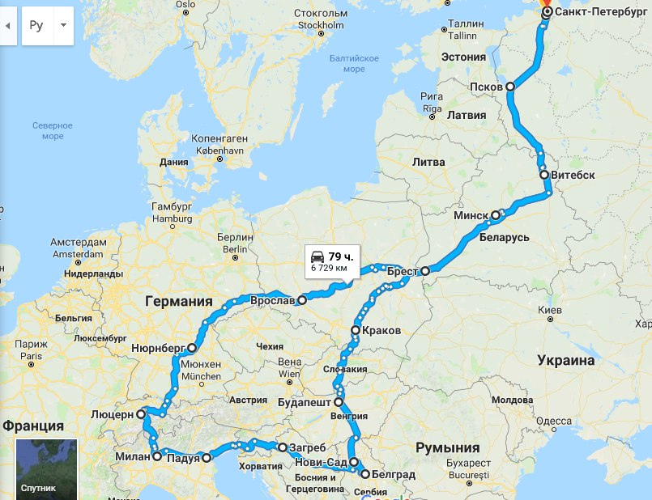
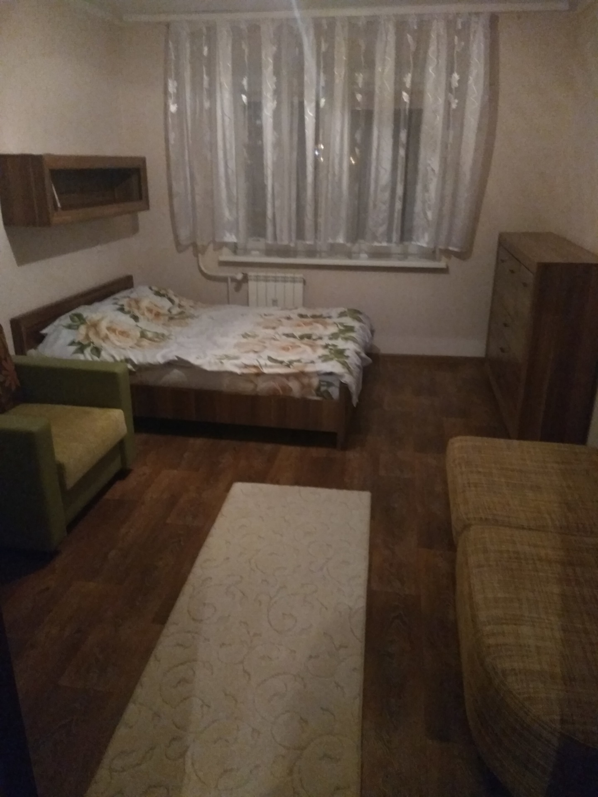

# Из Санкт-Петербурга в Европу на автомобиле — путешествие самостоятельно

Ехать в путешествие из Питера в Европу на машине мы собираемся как-то стремительно.

Помню, что у меня основной подготовкой в Петербурге становится порыв сделать как можно больше разных платежных карточек. Чтобы в Европе ни в коем случае не оказаться без возможности оплачивать. Тогда еще были популярны всякие «Кукурузы», карты Билайн и прочее — и всем этим можно было довольно выгодно платить за рубежом.

И еще — покупка жесткого диска. Который почему-то пришлось заказывать и забирать невесть откуда. Ибо Вайлдберрис и Озон тогда еще не было в том формате, что сейчас. Не помню, что именно казалось так важно с собой на нём везти. Видимо мои видеоролики по ДЧ, которые я собирался в дороге монтировать в перерывах между консультированием. Но в итоге, кажется, делал это только один раз — ночью в Бресте.

Значимым же в конце концов стал лишь сериал «Не родись красивой» — он тоже каким-то образом оказался записан на этом диске. Зачем я тащил с собой сотни серий попсового сериала 11-летней на тот момент давности с рейтингом 4.8 из 10 — не спрашивайте. Почему-то нам пришла такая идея. Впоследствие выяснилось, что не зря.

Еще некоторое скромное количество усилий занимает переписка с друзьями, к которым планируем заехать. Когда по [Дизайну Человека](https://ivaness.com/humandesign/) ты — 4/6, а по [астрологии](https://ivaness.com/astrology/) имеешь Юпитер в 11 доме — то все друзья, у которых можно остановиться за рубежом, почему-то оказываются именно твоими друзьями. Даже когда ты вроде бы махровый интроверт и социофоб.

А потом мы быстро собираем вещи (конкретно у меня получилось два рюкзака), садимся и едем. Как-то очень буднично, без пафоса и внутренних терзаний.

С этого момента рассказ про путешествие в Европу, по сути, и начинается. 

 

Вот карта, сделанная моей спутницей уже по результатам.

До того из всей Европы я бывал только в Финляндии. В Хельсинки и всяких милых маленьких городишках, вроде Порво. И то, впервые это было за несколько месяцев до данного путешествия. А ранее — не вылезал из Юго-Восточной Азии и Индии, и был рьяным сторонником восточной культуры и путешествий именно туда.

Так что это первое мое серьезное посещение Европы. Поэтому попутно буду называть места субъективного рейтинга европейских городов, в которых мы побывали. Беларусь в него тоже включу, почему — об этом ниже. А в конце своего рассказа выдам рейтинг целиком.

Ну а главное в этом повествовании — конечно белградская эпопея. Там произошли события, заслуживающие если не романа — то, как минимум, повести. Заранее рассказывать не буду, чтобы не сбить интригу.

А теперь — поехали. Вполне буквально.

## Питер — Псков: расстояние на машине по трассе — 283 км, время в пути — порядка 4 часов

Первой остановкой на пути из Питера оказывается Псков. Пока едем — становится совсем темно, да и дорога — так себе, поэтому получается не очень быстро.

Квартира колоритная, но странная. На кухне — душевая кабина. Фотографий кабины, увы, не сохранилось. В комнате — торшер на гигантской дуге.

  
    
    
    
    
      
        
          
            
            
            <meta itemprop="width" content="1200" />
            
            <meta itemprop="height" content="900" />
            
            
            
            
          
          
          
            

              Странная квартира во Пскове
            

          
        
        
        
          
            
            
            <meta itemprop="width" content="1200" />
            
            <meta itemprop="height" content="900" />
            
            
            
            
          
          
          
            

              Кровать арендованного жилья в Пскове
            

          
        
        
        
          
            
            
            <meta itemprop="width" content="1200" />
            
            <meta itemprop="height" content="1600" />
            
            
            
            
          
          
          
            

              Кухня — к сожаленю, душ не виден
            

          
        
        
        
          
            
            
            <meta itemprop="width" content="1200" />
            
            <meta itemprop="height" content="900" />
            
            
            
            
          
          
          
            

              Вот где-то здесь стояла и наша машина
            

          
        
      
    
    
    <button class="eedee-gutenslider-nav eedee-gutenslider-prev"><svg xmlns="http://www.w3.org/2000/svg" viewBox="0 0 24 24" width="24" height="24"><circle class="bg" cx="13" cy="12" r="11" /><path fill="none" d="M0 0h24v24H0z"/><path class="arrow" d="M10.828 12l4.95 4.95-1.414 1.414L8 12l6.364-6.364 1.414 1.414z"/></svg></button><button class="eedee-gutenslider-nav eedee-gutenslider-next"><svg xmlns="http://www.w3.org/2000/svg" viewBox="0 0 24 24" width="24" height="24"><circle class="bg" cx="11" cy="12" r="11" /><path fill="none" d="M0 0h24v24H0z"/><path class="arrow" d="M13.172 12l-4.95-4.95 1.414-1.414L16 12l-6.364 6.364-1.414-1.414z"/></svg></button>
    
    
    
    
    
    
  

Вывод напрашивается лишь один — кажется, мы недооценили наши запросы к жилью. И, соответственно, весь бюджет путешествия. Надо бы больше работать, и дальше снимать что-то поприличнее.

Хотя сейчас вопрос скорее в том, чтобы снять хоть что-то. Ибо владелец квартиры в **Ново-Полоцке** — следующем месте остановки — почему-то не отвечает на сообщения.

Пока я, зверски не выспавшись, и по этому поводу аж приняв фенотропил (тогда в продаже еще был настоящий, а не как сейчас), пишу клиентам, З. активно переписывается с ЭйрБНБ. И даже созванивается.

Меж тем, наступил срок чекаута, и странную квартиру надо освобождать. Поэтому продолжаем наши мероприятия уже прямо в машине, стоящей около дома.

ЭйрБНБ наконец выдает купон в компенсацию произошедшей подставы. Тогда саппорт еще был очень лояльным к пользователям. На этот купон бронируем квартиру уже не в Ново-Полоцке, а внезапно в **Витебске**. Где-то на окраине.

Едем обедать, поскольку голод — он не тетка, а вообще неизвестно кто. Рестораны в Пскове — весьма. Дешево — и даже не сердито, а вкусно.

Теперь — в Витебск. Эх, загадочный Ново-Полоцк, не посмотрим мы тебя.

## Псков — Витебск: расстояние на машине по трассе 344 км, граница между Россией и Беларусью, время в пути — 4.5 часа

В пути я занят перепиской с клиентом, поэтому как доехали от Пскова до Витебска — помню смутно. И сколько там километров — тоже написал чисто по карте. Ибо маршрут достаточно очевиден.

Запомнилась лишь деревня Лобок на границе с Беларусью. И то — только своим названием. В остальном от встречи с Лобком как-то всегда ожидаешь большего.

Квартира на этот раз — вполне, хоть и на самой окраине Витебска. Зато современная и рядом с большим супермаркетом.

Витебским утром сразу оформляю гостевую белорусскую сим-карту, и следующие дни мы пользуемся для интернета именно ей. В салоне связи в очередной раз поражаюсь вежливости и внимательности здешнего персонала.

Вообще к Беларуси я питаю нежные чувства давно и устойчиво. Особенно, конечно, к волшебному городу Бобруйск. Однако столицу — **Минск** — тоже очень люблю.

Дело в том, что Беларусь, несмотря на очень скромный бюджет страны и населения, умудрилась не только сохранить, а даже еще больше вырастить удивительную цивилизованность взаимодействий. До которой многим европейским городам вообще не дотянуться. Этим она меня еще в прошлый визит — году в 2007 — приятно поразила.

Здесь с тобой очень культурно, приветливо и любезно общаются… практически везде.

В Германии или Швейцарии это делают не везде.

В Сербии и Хорватии — от случая к случаю. И приветливости (такой — по-балкански суровой, словно встретились двое пожилых однополчан в отставке) в югославах больше, нежели культуры и предупредительности.

На севере Италии… хм. Когда как.

Про Польшу вообще молчу.

А Беларусь в этом плане прямо боюсь сглазить.

Кстати и люди здесь, в среднем, сильно менее напряженные и агрессивные, чем в России. И более открытые и позитивные.

Посмотреть Витебск особо не удается — надо мчать в сторону **Германии** и **Швейцарии** к оговоренным с друзьями срокам. Даже не знаю, впрочем, есть ли в Витебске что смотреть.

Поблагодарив хозяина, едем в Минск. В машине слушаем песни из советских мультфильмов.

## Витебск — Минск через Оршу: расстояние на автомобиле по трассе — 293 км, время в пути — около 4 часов

В Минск въезжаем в сумраке под абсолютно шизофазический текст Юнны Мориц в исполнении четы Никитиных:

<blockquote class="wp-block-quote is-style-quote is-layout-flow wp-block-quote-is-layout-flow">
  

    А лошадь летает и думает, что самый большой секрет — это летание лошади, нелётных животных летание.
  

</blockquote>

Нелётных животных летание. Что она курила, чтобы создавать такие тексты?.. И где это брала в советские времена?.. 🙂

Близнецы, напряженные Нептуном — думаю я каждый раз, как слышу тексты Юнны Мориц. Наверняка. К гадалке не ходи.

Так, кстати, и оказывается. Тау-квадрат из рыбьей Луны, битой оппозицией Нептуна, на близнецовое Солнце ([Квадрат Солнце-Луна](https://ivaness.com/luna-solnce-kvadrat/)).

В Минске я уже бывал, поэтому фотографий не делаю. Квартира в какой-то высотке, вроде — недалеко от центра. Обшарпанная, но неплохая. Больше даже похожая на гостиницу.

Ужинаем в ресторане поблизости, успеваем сходить в магазин, потом пол ночи пишу клиенту.

## Минск — Брест: расстояние на машине 351 км, время в пути — порядка 5 часов с учетом обеда и фотосессии зубров

А утром сразу же едем в сторону Бреста.

Даже завтракаем уже в ресторанчике по пути. Вполне, впрочем, приличном.

Тут фото есть. Легендарный зубр на трассе М1 Минск-Брест. Даже два.

  
    
    
    
    
      
        
          
            
            
            <meta itemprop="width" content="1440" />
            
            <meta itemprop="height" content="1920" />
            
            
            
            
          
          
          
            

              Зубры (или бизоны?..) по дороге из Минска в Брест. Я и еще один крутой чувак
            

          
        
        
        
          
            
            
            <meta itemprop="width" content="1440" />
            
            <meta itemprop="height" content="1920" />
            
            
            
            
          
          
          
            

              Или кто-то из нас — зубр, а кто-то — бизон?..
            

          
        
        
        
          
            
            
            <meta itemprop="width" content="950" />
            
            <meta itemprop="height" content="703" />
            
            
            
            
          
          
          
            

              Таки он — зубр. Металлоконструкция «ЗУБР»!
            

          
        
      
    
    
    <button class="eedee-gutenslider-nav eedee-gutenslider-prev"><svg xmlns="http://www.w3.org/2000/svg" viewBox="0 0 24 24" width="24" height="24"><circle class="bg" cx="13" cy="12" r="11" /><path fill="none" d="M0 0h24v24H0z"/><path class="arrow" d="M10.828 12l4.95 4.95-1.414 1.414L8 12l6.364-6.364 1.414 1.414z"/></svg></button><button class="eedee-gutenslider-nav eedee-gutenslider-next"><svg xmlns="http://www.w3.org/2000/svg" viewBox="0 0 24 24" width="24" height="24"><circle class="bg" cx="11" cy="12" r="11" /><path fill="none" d="M0 0h24v24H0z"/><path class="arrow" d="M13.172 12l-4.95-4.95 1.414-1.414L16 12l-6.364 6.364-1.414-1.414z"/></svg></button>
    
    
    
    
    
    
  

Вот, какой я тогда был толстый (имелся в моей жизни такой период, при всей изначальной эктоморфности), с длинными волосами и без бороды.

## Квартиры в Бресте — три вместо одной

В Бресте происходит странное.

Мы селимся в квартиру за рекой. Квартира с виду вроде сносная, но находиться в ней я почему-то совершенно не могу. Накатывает какой-то жуткий невыразимый сплин.

Тогда я еще мало задумывался о том, насколько для меня, с моим четверодомным СолнцеПлутоном, напрягающим двенадцатидомную Луну, важен вопрос жилья. И как я ярко и однозначно чувствую, когда в квартире кто-то когда-то умер, и т.п.

То есть я знал, конечно, что ощущаю атмосферу в жилище. Меня еще в детстве порой пускали в жилье вместо кота — почувствовать, чо там как. Но чтоб настолько.

Дабы развеяться, идём в магазин. Но это не помогает.

За рекой какой-то странный весь район, а не только квартира. С виду — обычные спальные новостройки, торговые центры и т.д. Ничего особенного не происходит. А атмосфера — давящая и страшная, слово в триллере. Даже тревожная музыка не нужна.

А может это квартира так повлияла, не знаю.

 

В Бресте мы собирались передохнуть два дня и отоспаться. В этой квартире, да. Но сейчас я не могу представить даже того, чтобы остаться в ней хотя бы на ночь. Ощущение, что мы тут уснем и не проснемся. Даже не понимаю, в чем конкретно дело.

Приходится в срочном порядке искать другую квартиру. На прямо вот сейчас. 

З. удивительно терпеливо сносит все эти выверты моей психики — и ищет. Квартира находится — но только на одну ночь.

Вызваниваем хозяев нынешней квартиры, а когда они приходят — муж и жена — начинаем сбивчиво плести что-то о том, что наверху играют на фортепьяно, и спать и работать в такой обстановке невозможно.

Не могу же я взять обоих за грудки, прижать к стене, и спросить: «Признавайтесь, у вас тут кто-то помер, а вы сдаёте?! Священника бы что ли сначала привели, или хоть святой водой побрызгали!» Хотя хочется именно этого.

На фортепьяно, к слову, сверху и правда играют.

Хозяева не слишком довольны происходящим, но находиться в этой квартире настолько невыносимо, что мы буквально сбегаем. Кажется, какой-то залог ЭйрБНБ в итоге даже оставляет им. Да и хрен с ним.

Новая найденная квартира — на другой стороне реки, ближе к центру, в районе улицы Хоружей и Коммунистической. В двухэтажном домике на пару парадных с деревянной лестницей. Постройки, наверное, середины прошлого века.

Квартира очень колоритная, и ощущения тоски в ней нет совершенно.

  
    
    
    
    
      
        
          
            
            
            <meta itemprop="width" content="1200" />
            
            <meta itemprop="height" content="900" />
            
            
            
            
          
          
          
            

              Квартира в Бресте на Хоружей — вполне уютная, особенно — в сравнении с предыдущей
            

          
        
        
        
          
            
            
            <meta itemprop="width" content="1200" />
            
            <meta itemprop="height" content="900" />
            
            
            
            
          
          
          
            

              На обратном пути мы, кстати, ее же сняли
            

          
        
        
        
          
            
            
            <meta itemprop="width" content="720" />
            
            <meta itemprop="height" content="540" />
            
            
            
            
          
          
          
            

              Колоритная квартира — увы, оба раза получилось лишь посуточно
            

          
        
        
        
          
            
            
            <meta itemprop="width" content="1200" />
            
            <meta itemprop="height" content="1600" />
            
            
            
            
          
          
          
            

              Кухня. Довольно сухая
            

          
        
        
        
          
            
            
            <meta itemprop="width" content="1920" />
            
            <meta itemprop="height" content="1272" />
            
            
            
            
          
          
          
            

              Я успокоился. И теперь буду пол ночи работать вместо того, чтобы спать. 🙂
            

          
        
      
    
    
    <button class="eedee-gutenslider-nav eedee-gutenslider-prev"><svg xmlns="http://www.w3.org/2000/svg" viewBox="0 0 24 24" width="24" height="24"><circle class="bg" cx="13" cy="12" r="11" /><path fill="none" d="M0 0h24v24H0z"/><path class="arrow" d="M10.828 12l4.95 4.95-1.414 1.414L8 12l6.364-6.364 1.414 1.414z"/></svg></button><button class="eedee-gutenslider-nav eedee-gutenslider-next"><svg xmlns="http://www.w3.org/2000/svg" viewBox="0 0 24 24" width="24" height="24"><circle class="bg" cx="11" cy="12" r="11" /><path fill="none" d="M0 0h24v24H0z"/><path class="arrow" d="M13.172 12l-4.95-4.95 1.414-1.414L16 12l-6.364 6.364-1.414-1.414z"/></svg></button>
    
    
    
    
    
    
  

Но, правда, это только на сутки. На следующие придется снимать что-то еще, и опять переезжать. Снимаем квартиру вообще в самом центре, очень приличную, но уже совсем выбивающуюся из бюджета.

  
    
    
    
    
      
        
          
            
            
            <meta itemprop="width" content="1440" />
            
            <meta itemprop="height" content="1920" />
            
            
            
            
          
          
          
            

              Квартира в центре Бреста
            

          
        
        
        
          
            
            
            <meta itemprop="width" content="1440" />
            
            <meta itemprop="height" content="1920" />
            
            
            
            
          
          
          
            

              В первую очередь — сухая кухня, конечно
            

          
        
        
        
          
            
            
            <meta itemprop="width" content="1440" />
            
            <meta itemprop="height" content="1920" />
            
            
            
            
          
          
          
            

              Комната
            

          
        
        
        
          
            
            
            <meta itemprop="width" content="1440" />
            
            <meta itemprop="height" content="1920" />
            
            
            
            
          
          
          
            

              Вид с балкона на какую-то стройку
            

          
        
        
        
          
            
            
            <meta itemprop="width" content="1440" />
            
            <meta itemprop="height" content="1920" />
            
            
            
            
          
          
          
            

              Вот так выглядит та самая «квартира, где деньги лежат»
            

          
        
      
    
    
    <button class="eedee-gutenslider-nav eedee-gutenslider-prev"><svg xmlns="http://www.w3.org/2000/svg" viewBox="0 0 24 24" width="24" height="24"><circle class="bg" cx="13" cy="12" r="11" /><path fill="none" d="M0 0h24v24H0z"/><path class="arrow" d="M10.828 12l4.95 4.95-1.414 1.414L8 12l6.364-6.364 1.414 1.414z"/></svg></button><button class="eedee-gutenslider-nav eedee-gutenslider-next"><svg xmlns="http://www.w3.org/2000/svg" viewBox="0 0 24 24" width="24" height="24"><circle class="bg" cx="11" cy="12" r="11" /><path fill="none" d="M0 0h24v24H0z"/><path class="arrow" d="M13.172 12l-4.95-4.95 1.414-1.414L16 12l-6.364 6.364-1.414-1.414z"/></svg></button>
    
    
    
    
    
    
  

В целом Брест оказался настолько эстетичен и хорош, что некоторым польским и даже сербским местам, в которые мы попадём далее, с ним и близко не тягаться.

А контраст между атмосферой в центре и за рекой только делает его колоритнее и загадочнее.

Брест вместе с Минском, пожалуй, делят почетное **5 место** в рейтинге всех городов, что мы проехали.

  
    
    
    
    
      
        
          
            
            
            <meta itemprop="width" content="1440" />
            
            <meta itemprop="height" content="1920" />
            
            
            
            
          
          
          
            

              Центр Бреста прямо около нашей квартиры
            

          
        
        
        
          
            
            
            <meta itemprop="width" content="1440" />
            
            <meta itemprop="height" content="1920" />
            
            
            
            
          
          
          
            

              Продтовары №7. Искал потом Продтовары №6, и таки нашел! По дороге к границе с польским Тересполем. Но сфотографировать из окна машины не успел.
            

          
        
        
        
          
            
            
            <meta itemprop="width" content="1440" />
            
            <meta itemprop="height" content="1920" />
            
            
            
            
          
          
          
            

              Еще немного о продтоварах. Они вообще в Бресте популярны.
            

          
        
        
        
          
            
            
            <meta itemprop="width" content="1920" />
            
            <meta itemprop="height" content="1440" />
            
            
            
            
          
          
          
            

              Чай «ЛистАпад». Белорусский язык такой белорусский
            

          
        
        
        
          
            
            
            <meta itemprop="width" content="1440" />
            
            <meta itemprop="height" content="1920" />
            
            
            
            
          
          
          
            

              Вроде бы это он и есть. Оказался каким-то зеленым
            

          
        
        
        
          
            
            
            <meta itemprop="width" content="1440" />
            
            <meta itemprop="height" content="1920" />
            
            
            
            
          
          
          
            

              Стильная, модная, молодежная стена в туалете кофейни
            

          
        
        
        
          
            
            
            <meta itemprop="width" content="1440" />
            
            <meta itemprop="height" content="1920" />
            
            
            
            
          
          
          
            

              В какой бы сервис в той или иной стране я б ни обратился — персонал зачастую попадается тормозной до ужаса. Возможно, конечно, дело в моей нетерпеливой натуре. Но этот чистильщик обуви реально прям вообще не шевелился! Уже стемнело — а я всё сидел.
            

          
        
        
        
          
            
            
            <meta itemprop="width" content="1440" />
            
            <meta itemprop="height" content="1920" />
            
            
            
            
          
          
          
            

              Только улыбается, но ничего не делает!
            

          
        
      
    
    
    <button class="eedee-gutenslider-nav eedee-gutenslider-prev"><svg xmlns="http://www.w3.org/2000/svg" viewBox="0 0 24 24" width="24" height="24"><circle class="bg" cx="13" cy="12" r="11" /><path fill="none" d="M0 0h24v24H0z"/><path class="arrow" d="M10.828 12l4.95 4.95-1.414 1.414L8 12l6.364-6.364 1.414 1.414z"/></svg></button><button class="eedee-gutenslider-nav eedee-gutenslider-next"><svg xmlns="http://www.w3.org/2000/svg" viewBox="0 0 24 24" width="24" height="24"><circle class="bg" cx="11" cy="12" r="11" /><path fill="none" d="M0 0h24v24H0z"/><path class="arrow" d="M13.172 12l-4.95-4.95 1.414-1.414L16 12l-6.364 6.364-1.414-1.414z"/></svg></button>
    
    
    
    
    
    
  

На следующий день едем на автомобиле на границу с Польшей. Благо, она рядом.

**Из Санкт-Петербурга в Европу** приехали, дальше — уже сама Европа. Ее буду описывать подробнее — по одному городу или хотя бы стране за раз. 🙂

