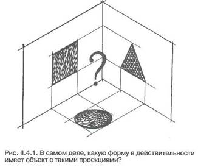
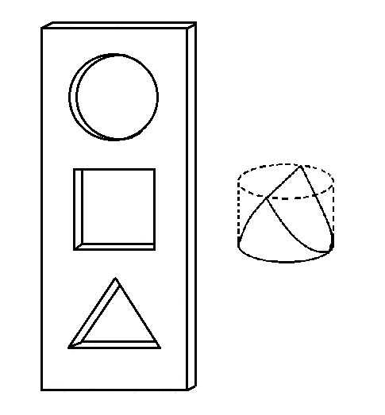
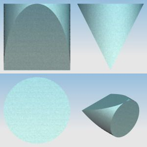
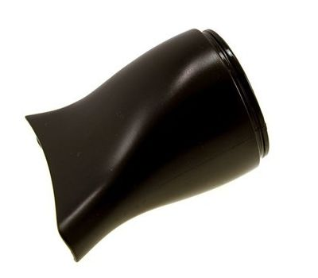
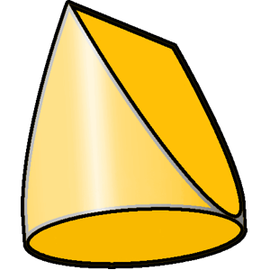

# Концепция «Реальность»: проекции мироздания

<blockquote class="wp-block-quote is-style-info is-layout-flow wp-block-quote-is-layout-flow">
  

    Здесь сформулирован подход к знаниям, который лег в основу проекта «FAQ по реальности». И является его основной концепцией, миссией и реализуемыми задачами.
  

</blockquote>

Теориям, объясняющим устройство мира, еще со школы не удавалось вызвать у меня должного доверия. Было одинаково сложно толком уверовать и в научные построения, и в «антинаучные», и в многочисленные промежуточные варианты. Я изучал, но убежденности не чувствовал. Видимо верить — в принципе не моё.

С возрастом это стало выражаться в стремлении показать людям, насколько погрязли они в обманчивых умственных дебрях, и как эти дебри их ограничивают. Я отпускал [шутки](https://realfaq.org/threads/tserkov-ob-yektivnoi-real-nosti.10/) об «объективной реальности». Создавал проекты, вроде «Соционики нет!», где [объяснял](https://ivaness.com/psihologicheskaya-tipologiya-klassifikaciya/), насколько наблюдаемое зависит от взгляда наблюдателя.

Годы [работы с подсознанием](https://realfaq.org/forums/rabota-s-podsoznaniem/) только усилили мой нигилизм, наглядно показав иллюзорность умственных построений во всей красе. Стремление отбросить лишнее и не плодить ненужных сущностей и ментальных конструкций стало для меня лейтмотивом.

<blockquote class="wp-block-quote is-style-thumbs-up is-layout-flow wp-block-quote-is-layout-flow">
  

    Но с этого момента декларируемая мной картина мира меняется. Отныне я не отрицаю ничего. Потому, что нашел способ примирить меж собой любые умопостроения.
  

</blockquote>

О чем это я?.. Ах да, о реальности.

## Реальна ли реальность?

Понятия «объективная реальность» и «бог» действительно схожи. И в то, и в другое многие верят, но никто не видел воочию. И не увидит. Иначе бог не был бы богом, а объективная реальность не была бы объективной.

Восприятие субъекта субъективно по определению. У нас нет доступа к чему бы то ни было «объективному». Изнутри системы систему не познать. А мы находимся внутри реальности. Внутри самих себя — субъектов.

Притчу о том, как [слепцы изучали слона](https://ru.wikipedia.org/wiki/Слепые_и_слон), знают все. Пересказывать нет смысла. Любая теория, даже сто раз подтвержденная практикой, вот так и щупает действительность. Как слепые — того слона.

<blockquote class="wp-block-quote is-style-danger is-layout-flow wp-block-quote-is-layout-flow">
  

    Проведи мы тысячи повторяемых валидных экспериментов — все равно останемся субъективными наблюдателями. Собери мы хоть миллиард человек и опроси о том, что дано им в ощущениях — на пересечении этих ощущений не возникнет «объективной реальности».
  

</blockquote>

Потому, что реальность, пользуясь геометрической аналогией, в принципе обладает бóльшей мерностью, чем любые проекции оной в сознание наблюдателя.

## На стыке философии и стереометрии

Корректно было бы сказать, что реальность имеет бесконечное число измерений. Но мы, для визуального упрощения, воспользуемся стереометрией, и представим себе модель «истины» сложной трехмерной фигурой.

В таком случае любые наши знания об «истине», максимум, двумерны.

Иными словами, все, что мы знаем — не более, чем проекции реальности на разные «плоскости». Внутри себя каждая проекция может быть цельной и непротиворечивой. И даже помогать понять и объяснить какие-то свойства исследуемого объекта. Однако увидеть объект таким, каков он в действительности, мы не сможем ни в одной.

Кроме того, даже несколько проекций не помогут нам составить об объекте всестороннее представление. Да, такое работает с трехмерной фигурой. Но реальность — не трехмерный кубик. Её мерность никому не ведома.

## В голове моей опилки

Как поступает большинство людей? Очень просто. Они склонны запираться в одной-двух проекциях реальности, и объяснять все ими, скептически относясь к прочим.

<blockquote class="wp-block-quote is-style-thumbs-down is-layout-flow wp-block-quote-is-layout-flow">
  

    Адепты научного подхода не терпят теистов и шизотериков за ненаучность. Шизотерики презирают адептов научного подхода и теистов за узость мышления, умело не замечая того же самого <s>только в профиль</s> у себя. Теисты не переносят всех вместе взятых, включая теистов иной веры. За безбожие или богохульство.
  

</blockquote>

Думаете, это я про какие-то избранные группы лиц сейчас говорю? Да ничуть. Это совершенно рядовые граждане, иногда — сами того не замечая, вот на такие категории делятся. Зачем-то.

Впрочем, в специализированных областях ситуация не лучше. В теме изучения свойств личности, например.

Психологи считают социоников адептами примитивной лженауки, а астрологов, тарологов и прочих хьюмандизайнеров — вообще шарлатанами. Соционики с мнением про астрологов согласны, однако твердо убеждены, что соционика — часть психологии. Вот только других ее частей они не изучают. Видимо, из обоснованного страха потерять веру в соционику. Астрологам на них всех вообще положить. Они уверены, что владеют древним знанием, поэтому места под здравый смысл в их головах не отведено. И т.д.

В общем, вы поняли. Постичь таким способом что-либо, кроме однобоких умопостроений, невозможно. Это — тупиковый путь.

Вот вам соответствующая картинка из задачника по стереометрии:

## Верь, бойся, проси!

Итак, будем рассматривать каждую область знаний о мире и человеке — от научных до самых эзотерических — как проекцию «реальности» на соответствующую «плоскость».

Да, области знаний иллюзорны без исключения. Но считать их ошибочными только из-за того, что они не могут адекватно отразить действительность — узко и бесперспективно. Куда конструктивнее допустить, что они не передают ее потому, что упрощены и искажены. Они — проекции. И обладают всеми свойствами проекций.

<blockquote class="wp-block-quote is-style-warning is-layout-flow wp-block-quote-is-layout-flow">
  

    Агностицизм всегда был близок к истине в своем неверии в ее познаваемость.
  

</blockquote>

Нам не дано постичь систему, в которой мы находимся. Именно потому, что мы — часть ее.

Зато у нас есть проекции. Огромное количество проекций действительности на самые разные «плоскости». И пренебрегать любой из них — означает закрывать глаза на какой-то из срезов истины. Тем самым запирая для себя саму невозможную возможность ее постичь.

При этом инструмента для отбраковки тех или иных проекций, как «ложных» или «ошибочных», у нас попросту нет. Ведь такой инструмент был бы не более, чем очередной проекцией. Исходя из которой мы пытались бы оценить достоверность других. Из одного убеждения судить другое убеждение — что может быть глупее и бессмысленнее с точки зрения познания?.. Однако именно этим мы и занимаемся постоянно, отделяя то, что нам кажется правдоподобным, от того, что кажется ересью.

Наш субъектный ум не способен адекватно оценить, что стоит оставить, а что нужно выбросить. Использовать его для этого — значит бесконечно плавать в болоте заблуждений. Потому, что по факту нужно либо выбросить ВСЁ — либо всё оставить, и признать, что в мире идей нет НИЧЕГО лишнего. Будь оно серьезно-научное, или самое что ни на есть абсурно-мистическое.

Раньше я акцентировал внимание на иллюзорности любой концепции. Я застрял на той стороне медали познания, где есть лишь Пустота.

Теперь я хочу посмотреть другую сторону медали. Ту, где есть все сущее, а энтропия максимальна.

Каждая проекция хоть немножко, но увеличивает широту наших представлений о том, что в исконном виде нам все равно не узреть. Об «истине». О «реальности». Вне зависимости от того, существует она, или ее вовсе нет, а есть лишь эти проекции — бесчисленные проекции Пустоты на разные плоскости взглядов.

 

Фиг поймешь по каждой отдельно взятой проекции, что там, правда?.. Может шар. Может куб. Может вообще — тетраэдр. Вот так и с реальностью.

Мы не можем узнать, есть ли реальность, и какова она. **Объективная** реальность недоступна для постижения **субъектами**. Мы можем только стремиться к этому. 

И путь тут один — синтез множества проекций реальности на различные концепции, идеи и точки зрения. Не отбрасывая ни одну из них.

<blockquote class="wp-block-quote is-style-thumbs-up is-layout-flow wp-block-quote-is-layout-flow">
  

    Скажем «Нет!» бритве Оккама! Не отсекай ничего! Множь сущности! Не существует ЛИШНИХ проекций! <s>Больше хаоса! Не будь проще! Верь, бойся, проси! Да здравствует максимальное погружение в Сансару!</s>
  

</blockquote>

Только это позволит сделать голограмму реальности в нашем сознании настолько точной, насколько это возможно, и максимально приблизить ее к реальности «объективной».

## Кристалл Реальности

Знакомьтесь, друзья, это — **Кристалл Реальности**. Символ нашей с вами всеобъемлющей концепции «Реальность».

И — та самая загадочная фигура, которая, будучи спроецирована на три перпендикулярные плоскости, дает в проекции круг, треугольник и квадрат. 

Она и вправду существует. <s>А вот насчет реальности не поручусь.</s> И как нельзя лучше отражает суть концепции. Глядя на неё, совершенно очевидно, что ни одна из проекций и близко не передаёт нам истину. Однако все они важны, и ни одна не является лишней или ложной.

Ничего не напоминает?.. Особенно дамам?.. Точно! У фена есть похожая насадка. 🙂

Для мужиков более брутальная аналогия — примерно так заканчивается жало паяльника.

Впрочем, в Кристалле Реальности каждый видит свое. Как и в самой реальности. В этом тоже проявляется символизм Кристалла.

## Добро пожаловать в реальность!

Выше я упоминал, что с верой у меня затруднения. Я давно не пытаюсь заниматься какими-либо областями знаний полностью «всерьез». Ни в одну не верю по-настоящему. Для меня любая из них — набор допущений. Некая посылка, в рамках которой можно что-то изучать. Всегда понимая, что это — не есть истина.

Конечно же, я такой не один. Нас таких достаточно много. Обычно я называл это «многомерным ([нелинейным](https://realfaq.org/threads/memy-etogo-foruma.11172/)) мышлением». Теперь знаю, как сформулировать более доступно.

Отныне, чем бы я ни занимался, я не занимаюсь этой областью знаний. Я занимаюсь **ПРОЕКЦИЕЙ РЕАЛЬНОСТИ на эту область знаний**.

Проекцией реальности на физику. Проекцией реальности на религию. Проекцией личности на соционику. Проекцией чьей-либо индивидуальной реальности на Дизайн Человека. 

С какой бы убежденностью ни нес я ту или иную информацию в массы, следует понимать, это — лишь одна из многочисленных проекций истины, а не сама истина.

Если вам это подходит — приглашаю делать так же. 

Как проверить, подходит ли?.. 

Очень просто. По тому, близок ли вам хоть один из приведенных ниже аргументов. 🙂

  - 
    <strong>Это комфортно</strong>. Сразу перестаешь ощущать себя упертым болваном, пытающимся запереть собственный разум в очередной системе убеждений. Ты лишь взял её в свою коллекцию бесчисленного множества ракурсов мироздания. И с интересом рассматриваешь этот экспонат. А потом отложишь его, и будешь рассматривать следующий. Но и к этому всегда сможешь вернуться и пустить его в дело, если потребуется. Больше не надо очаровываться, разочаровываться, и «перерастать» одну систему координат для того, чтобы тут же запереть себя в следующей.
  
  - 
    <strong>Это масштабно</strong>. Концепция «Реальность» — это надстройка надо всеми областями знаний. Так сказать, информационная среда для их разработки. Которая позволяет человеку любой широты взглядов свободно оперировать любыми постулатами любой теории с любой степенью убежденности, не делая лишних оговорок об относительности всего сущего, и не вступая при этом в конфликт с собственным скепсисом, критическим мышлением <s>авторскими правами</s> и многомерностью восприятия действительности.
  
  - 
    <strong>Это не стыдно</strong>. :)) Теперь вы можете читать даже астрологические прогнозы в желтой прессе, не чувствуя себя суеверным идиотом. Вы в этот момент — исследователь, постигающий проекцию реальности на упрощенную газетную версию определённой эзотерической дисциплины.
  
  - 
    <strong>Это полностью научно обосновано.</strong> Концепция «Реальность» возникла на стыке философии и математики. Все её идеи имеют прямые аналогии в стереометрии. До того однозначные, понятные и наглядные, что термины заимствованы дословно. Да-да, всё это вы изучали в старших классах школы. Просто не предполагали, насколько оно фундаментально. Не задумывались, что так устроено не только пространство. Так устроен процесс познания мира вообще.
  

Позже мы и о терминологии концепции «Реальность» поговорим.

Да пребудет с вами кристалл реальности. 🙂

_Авторы концепции: [Павел IvanesS](https://ivaness.com/me/)_, _[Валентина Valchonok](//vk.com/valchonok)_

  
    [Обсуждение концепции на форуме RealFAQ](https://realfaq.org/threads/kontseptsiya-real-nost-proyektsii-mirozdaniya.12403/)
  

