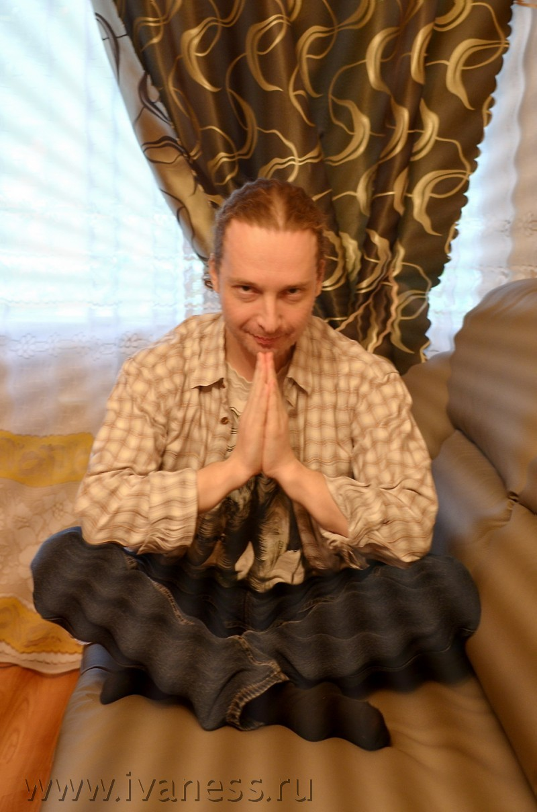

# Медитация простыми словами — это что такое? И нужно ли нам просветление?

Попробую пояснить, что такое медитация простыми словами, и для чего она нужна. А затем поговорим и про просветление. И нужно ли оно нам.

Чего чаще всего не понимают про медитации люди, от них далёкие?..

Они думают, что йог сидит и настраивается на какую-то определенную волну. Или пытается усиленно очищать ум. Или что-нибудь в этом духе. Что-то возвышенное.

На самом же деле (если мы говорим про настоящую медитацию, а не про лайтовые заигрывания с этой темой) обычно он сидит и наблюдает страдания своего тела от дискомфорта. И метания ума по этому поводу.

Не препятствует им, не пытается от них освободиться или отрешиться. Не отвлекается, не улетает мыслями в прекрасное далеко. Не думает о возвышенном. Не видит богов или свет в конце тоннеля.

Наоборот — максимально находится в здесь и сейчас. В теле. Просто присутствует и смотрит на происходящее.

И не реагирует. Не «ведётся» ни на какие призывы организма и мозга.

И чем бо́льшие страдания тела и метания ума ему приходится вот так безучастно наблюдать — тем эффективнее медитация.

Потому, что в этом и есть ее основная задача — приучить себя не отождествляться со всеми теми страданиями, которые несёт земная плотская жизнь и наши связанные с нею переживания. И через это освободиться и ото всех уже имеющихся зарядов тоже.

Да, попутно вы можете испытать массу интересных состояний и озарений. Но главная цель — в этом, а вовсе не в состояниях или озарениях.

Поэтому, в общем случае, чем больший дискомфорт (на грани переносимого, конечно) вы будете испытывать во время медитаций — тем лучше.

Всё остальное — антураж. По большому счету он не важен.

Хоть вы сядьте в лотос и обложитесь ароматическими палочками. Хоть скрючьтесь с кляпом во рту в углу грязного вонючего подвала. Больше того — второе в ряде случаев может оказаться даже эффективнее. 🙂

Это — специально для тех, кто не понимает, зачем нужна медитация, и что она делает.

 

Безусловно, люди позже придумали еще множество техник, которые назвали словом «медитация». И те, кто с ними сталкивался, возразят, что медитация — это далеко не всегда то, что я описал выше. Что вариантов гораздо больше.

Однако ж изначальная суть медитации — это именно наблюдать. Прочее — это уже надстройки разных подходов и направлений.

Стоит добавить, что часто медитации, кроме умиротворения и дисциплинирования ума, имеют и более долгосрочные функции. Та же Випассана, например, является очень хорошим методом депрограммирования подсознания. Работающим ничуть не менее эффективно, чем современные ПЭАТ, [аспектика][1] или [Турбо-Суслик](http://realfaq.ru/uploads/turbo-suslik.pdf).

И всё же базовая задача медитаций — это дисциплинировать ум и научить его позиции наблюдателя.

## Позиция наблюдателя в психологии и в жизни — это путь к просветлению или способ побега от происходящего?

Итак, позиция наблюдателя — это когда мы никак не отождествляемся с происходящим, не реагируем на него, а просто наблюдаем. 

Именно на достижение этого состояния направлены медитации и множество других техник.

<meta charset="utf-8" />
Позиция наблюдателя в психологии считается весьма ресурсной. Это действительно так. Способность взглянуть на происходящее не вовлекаясь — навык сам по себе очень полезный.

Но тут, как и с любой эффективной штукой, возникает искушение использовать её постоянно.

И вот это уже — решение неоднозначное. Для примера достаточно вспомнить, как некоторые люди, обнаружив в студенческие годы, как эффективен алкоголь для общения и расслабления, начинают употреблять его регулярно, и чем это заканчивается.

Тут уместно будет вспомнить, что именно способность находиться в состоянии наблюдателя, по сути, является основным критерием так называемого «просветления».

Упрощая, можно даже сказать, что состояние просветления — это и есть постоянное пребывание в позиции наблюдателя, в состоянии разотождествленности с происходящим.

И тут возникает вопрос: а действительно ли нам это нужно на постоянной основе? 

Попробуем разобраться.

Вы клали в детстве гвоздь на трамвайные рельсы, чтобы его расплющило, и можно было сделать ножик?..

Я — да.

Как ни странно, этот пример хорошо иллюстрирует популярные сегодня пути «просветления».

В то время, как взрослые разработали, построили, и поставили на массовое производство такую сложную конструкцию, как трамвай, продумали и проложили систему путей сообщения, освоили управление им, и занимаются пассажироперевозками — дети используют это технологическое достижение нового времени для создания примитивных орудий труда времен железного века.

К чему это я?..

А вот к чему.

Давайте в качестве возможного варианта представим, что мы (то, что принято называть душой) по собственному желанию приходим в этот мир ради того, чтобы с полным погружением отработать какую-то проблематику. Ту, которая и отражена во всех характеристиках нашего текущего воплощения — начиная от физических и психологических, и заканчивая всякими натальными картами.

Естественно, воплотившись, мы об этом забываем. Память о том, что это — лишь небольшая командировка, сильно затруднила бы полное погружение в процесс и в переживания.

И начинаем погружаться. Реализовывать замысел души. 

Иногда — радоваться. А чаще — страдать. Это ведь, как-никак, проживание **проблематики**. И желать избавиться от этого страдания.

Это придумал не я — вы знаете, что у этой версии происходящего куда более древние авторы. И, конечно, это лишь один из вариантов.

Но, если его принять, то с этого ракурса наши примитивные духовные «лайфхаки» в стиле: «нужно осознать, что ты — лишь наблюдатель за тем, что с тобой происходит» — которые были предложены еще Буддой, и в разных формах форсятся по сей день — выглядят совсем странно.

Как если бы мы собрались покататься на американских горках, чтобы пощекотать нервы, но в последний момент вдруг решили закинуться лошадиной дозой успокоительного, чтобы не сильно переживать.

Вроде бы всё логично, но встает закономерный вопрос: раз не хочешь нервничать, можно ведь было просто не кататься?..

Если душа наша приняла решение воплотиться — то, скорее всего, ее замысел заключался как раз в том, чтобы максимально погрузиться в Майю, в Сансару. Прожить по полной все радости и страдания — и вынести из них что-то при возвращении туда, наверх. Примерно как из тяжелой командировки мы привозим деньги и опыт работы.

А мы вместо этого находим примитивные трюки облегчить труд души, и снизить интенсивность погруженности, заняв позицию «наблюдателя». Техники специальные для этого придумываем, медитации.

Наш зазнавшийся ум в этот момент считает, что нашел выход. «Выход» из того, ради чего, собственно, мы сюда сюда и пришли. 

Словно, знаете, решил поработать, но забыл, что работаешь сам на себя, и начал придумывать возможности схалявить и откосить. 🙂

И иногда даже самонадеянно кажется, что уловил замысел души. Что смысл существования рельсового транспорта — расплющивать гвозди для самодельных ножиков.

## В чем суть просветления: куда мы стремимся?

Сам я, ничего не имея против медитаций как техники, ни к какому «дзену» и просветлению не стремлюсь.

Нет, когда-то было. Но давно. 

А потом вдруг как-то отпустило. В тот момент я даже где-то написал, что, мол, «[просветление — это отсутствие стремления к просветлению][2]«.

Ведь в каком-то смысле именно это и есть подлинная просветленность — осознать, что ты и так уже там, где надо. И всегда был именно там, где надо. А тогда к какому «просветлению» ты стремишься? Куда?..

Кроме того, если рассматривать «просветленность» как позицию наблюдателя — то она не является стабильным состоянием, которого можно было бы достичь и навсегда в нем остаться. Как нельзя, например, раз и навсегда почистить зубы или помыть голову. Мир вокруг таков, что они имеют тенденцию загрязняться об него снова и снова. И сами мы конструкционно таковы, что загрязняем себя со временем.

То есть, нет, способ остаться там навсегда существует. Это — смерть. После которой нас точно не будут беспокоить вещи, которые заботили при жизни в этом бренном мире.

А пока ты жив, состояние «просветленности» приходится поддерживать регулярными практиками. 

Это вам подтвердят и те, кто ездил на длительные ретриты, и даже монахи, годами живущие в монастырях. Стоит вернуться из ретрита или выйти из монастыря обратно в мир Майи — и через несколько дней «просветления» как не бывало. Хаос сансары снова захватил ум. Внутренняя пустота снова замусорилась. Особенно — если не практиковать ежедневных медитаций.

Мне доводилось проживать состояние «просветленности» в процессе медитаций или как результат серьезных проработок.

Но к стабильной «нирване» я не дошел, и не собираюсь. 

Потому, что по пути пришел к выводу, что абстрагироваться от жизни рано или поздно удастся каждому из нас. 🙂 Гарантированно. Даже если вообще ничего для этого не делать.

А пока мы живем в мире сансары — стоит пользоваться этим по максимуму. 

Быть полностью вовлеченными в Майю. Страдать, загоняться, ждать, надеяться, обламываться, злиться, завидовать, ревновать, снова надеяться, жалеть, обижаться, очаровываться, разочаровываться… Вот это вот всё. 

Это ж и есть жизнь.

Позже такой возможности может просто не быть.

 [1]: http://realfaq.ru/discussion/357/aspektika-tehnika-zhivorada-slavinskogo/p1
 [2]: http://ivaness.ru/page/zhiznennye-izrecheniya#sostoyanie-prosvetleniya

