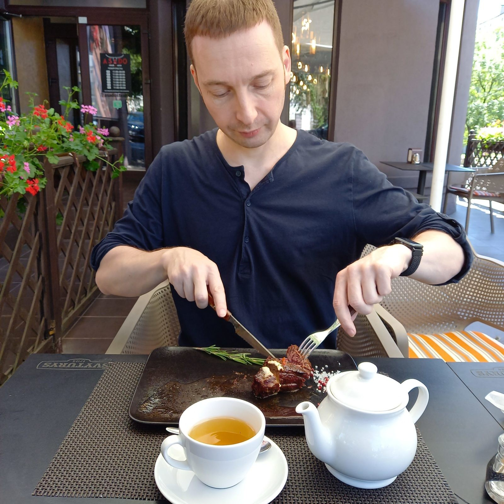

# Карнивор — диета хищника: принципы питания, отзыв и результат личного опыта

В отличие от большинства эзотериков, я и близко не вегетарианец, а ровно наоборот. Я придерживаюсь диеты хищника «Карнивор». Иногда, правда, добавляя к такой системе питанию немного овощей.

Сформулирую свои отзывы про карнивор-диету, ее принципы, список продуктов и мои результаты.

Вот только предупрежу, что я — не врач, и всё здесь описанное ни в коем случае не является медицинской рекомендацией — а лишь частным мнением.

## Мой карнивор — это не цель, и даже не средство. Эзотерические причины

Кетогенная безуглеводная диета Карнивор началась для меня с иррационального «хочу!»

Если по [Дизайну Человека][1] ты — спонтанный генератор, и живешь корректно, то именно так — из отклика — для тебя начинается большинство подобных мероприятий.

Я не имел намерения похудеть. У меня (тьфу-тьфу-тьфу) не было диабета 2 типа, эпилепсии или аутоимунных заболеваний, которым для ремиссии полезна диета без углеводов. Я вообще до этого мало интересовался диетами и способами питаться.

Когда в подобных случаях меня спрашивают: а для чего, а в чем цель того или иного моего увлечения — я обычно начинаю из ума судорожно выдумывать объяснения и аргументы, и что-то сбивчиво излагать.

Но это — всегда не совсем искренне. Поскольку истинная причина только одна: захотелось.

В такие моменты сразу понимаешь, что всё равно это сделаешь. Вне зависимости от того, что там думает ум или говорят окружающие.

Тем не менее, ум не замедлил подключиться.

Понимая, что последнего слова за ним не будет, ум у меня давно и мудро занял позицию: «Если не можешь противостоять какому-то движению — надо его возглавить!» Так ум поддерживает у себя иллюзию, что он все контролирует, и всё равно главный. 🙂

Поэтому он начал воодушевленно искать обосновывающие аргументы к моему порыву.

Ум сказал:

«Я ведь и правда давно хотел как-то контролировать свое питание. От него же зависит очень многое. Но по нынешним тенденциям «контролировать питание» — в 80% означает двигаться в сторону вегетарианства, сыроедения и т.п. А я всегда чувствовал, что это не моё. Даже долгое проживание в крайне вегетарианской Индии меня к этому не склонило.

Тем более, насчет сыроедения — у нас же 3 цвет левый тон по питанию. А значит, если отбросить нюансы, еда должна быть выше температуры тела. Сыроедение отпадает.

А что касается вегетарианства — у нас ведь Луна напряжена Марсом и Плутоном. А значит, жрать мясо — отличное компенсаторное размещение для этих энергий. А вот не жрать — наоборот, хреновое.

Точно! Эта диета — это же еще и [астрологическая компенсаторика][2]. Идеальное решение! Сколько зайцев одним махом можно будет убить. И съесть — в рамках мясной диеты, бугага.»

Короче, хитрый ум всё придумал, и остался по этому поводу очень собой доволен. Он опять доказал себе, что это — его решение, и что он сам так и хотел.

Тут выражение «Чем бы дитя ни тешилось — лишь бы жить не мешало» уместно как никогда. 🙂

 

Я перечитал в интернете огромное количество информации про карнивор и кето, и еще раз ощутил, что, да, теперь всё равно не остановлюсь, пока не попробую — даже если бы ум оказался против. А значит речь идет только о том, когда начать.

Честно признаюсь, что воистину гениальная практика «Делай сразу» — совсем не моя сильная сторона. Даже когда мне чего-то очень хочется — я могу это надолго отложить по самым разным причинам, и начать прокрастинировать через другую деятельность.

Ум не очень догадывается, но вот именно тут он (пусть даже это и бессознательные его установки) как раз пока еще может чем-то управлять. 

Астрологически же это олицетворяет квадрат Солнце-Марс — не вполне проработанный пока внутренний конфликт меж «хочу» и «делаю».

Но в данном случае желание было настолько выраженным, что меня не удержало даже самое страшное: придется научиться покупать мясо и готовить его. По счастью, как раз в тот момент, в силу торгово-инвестиционных манипуляций с собственной недвижимостью, я временно кантовался у мамы — и она меня многому научила.

В целом я не то чтобы чужд кулинарии. Но все мои таланты ограничиваются лишь кухней холостяка. А именно — сотнями рецептов приготовления яичницы, макарон и горячих бутербродов. Тут мне нет равных.

Но покупать чужую плоть (а именно так я ощущаю мясо), брать ее руками, мыть, резать… А потом еще непонятно как жарить или варить… Это было настолько за зоной моего комфорта, что никакая кето-адаптация не могла сравниться с этим по дискомфорту.

А кето-адаптация, меж тем, тоже оказалась весьма нелегкой.

## Кето-адаптация: длительность и симптомы

Когда перестаешь жрать углеводы — первое время организм думает, что его вообще перестали кормить, и он умирает. 🙂 И сколько бы жиров и белков ты ему ни скармливал — он все равно остается в этой мрачной иллюзии.

Встать с кровати по утрам вдруг становится далеко не самой простой задачей.

Из зеркала на тебя смотрит отражение, бледное как смерть.

Выносливость падает в ноль — поход в магазин рядом с домом утомляет, словно тридцатикилометровый марш-бросок. Единственное, чего после него хочется — это лечь и не шевелиться. Как, впрочем, и в остальное время.

Согласно литературе, это может продолжаться не так уж долго — дня четыре. Но даже четыре таких дня сильно деморализуют и демотивируют.

У меня это длилось около двух недель. Возможно — с непривычки. Ведь до того я никогда не тренировал у себя метаболическую гибкость, и без углеводов жил впервые.

Более того — я, признаться, раньше жрал просто огромное количество хлебобулочных. Буквально всё ел в виде бутербродов. И с этой точки зрения переход был для организма весьма радикальным.

Исходя из нынешнего опыта, сейчас я бы, конечно, действовал более постепенно. Но тогда этого опыта еще не было. А вот моя извечная склонность к максимализму — она всегда со мной.

Плюсом к вышеперечисленному болел живот в целом и желчный пузырь в частности. Тоже вполне закономерно. Почему — поясню ниже.

Ну и, конечно, незабываемые скачки от диареи (когда съел больше жиров) к запору (когда съел больше белков) — и обратно.

Ум начал регулярно ударяться в перепуганные рефлексии: «Да что же я делаю! Может мне это не подходит! Может именно на мне это не сработает! Может я сейчас себя убиваю! Собственными руками!»

Я игнорировал, и просто продолжал практиковать. Это чуть ли ни единственное эффективное поведение в таких ситуациях — вне зависимости от того, [сидите ли вы випассану][3], или соблюдаете диету.

Пил электролиты, чтобы восполнить их дефицит. Углеводы удерживают воду в организме, а когда их нет — вода начинает уходить вместе с электролитами.

Пил ферменты и бетаин, чтобы помочь пище перевариваться.

Контролировал каждый съеденный, а точнее — не съеденный, углевод.

Мерял уровень кетонов в моче (довольно бесполезное занятие — показывает лишь, что кетоны вырабатываются, но не показывает, усваиваются ли они — то есть в кетозе ли вы).

Но желанный кетоз всё никак не наступал.

Безумия происходящему добавляли встречаемые в интернете заголовки. В памяти тройным фейс-палмом засел один из них, пародирующий эталонно-банальные объявления на сайтах знакомств: «Состояние кетоза: почему его трудно найти, легко потерять и невозможно забыть?»

В конце концов, сквозь характерный для кето-гриппа «мозговой туман», мне начали повсюду мерщиться плакаты в советском стиле — с суровым красноармейцем и вдохновенным лозунгом: «В кетоз!»

А потом все вдруг просто стало как раньше. Вернулись силы, вернулась выносливость, вернулись концентрация и нормальное самочувствие.

Я надеялся ощутить себя сверхчеловеком — но сперва ощутил просто опять обычным собой. Так, будто ничего в питании и не менял.

А все бонусы стали проявляться не сразу, а очень постепенно. Спустя еще пару недель, как минимум.

## Как понять что ты в кетозе?

В статьях часто описывают, что, дескать, аппетит снижается. Что на сладкое совсем не тянет. Что голод легче переносится. Что после еды наступает не апатия — а, наоборот, бодрость.

Всё это — так. Но такие нюансы отследить не каждый сможет.

К счастью, на деле всё проще — если, конечно, контролируешь углеводы.

Потому, что если ты ешь крайне мало углеводов (до 20-30 грамм в сутки), но при этом не чувствуешь слабости, ясно мыслишь и не устаешь заметно быстрее обычного — скорее всего, ты в кетозе, друг. Или подруга.

## Плюсы кето-питания

Понятное дело, что для тех, кто садится на кето-питание именно как на диету, основная цель — похудеть.

Для меня такой цели не было, поэтому начну я с плюса, приятного лично для меня:

### Настроение на кето-диете и карнивор

Спокойствие.

Про карнивор пишут, что на этой диете тебя становится практически невозможно разозлить. Ничем и никогда. Про кето — не так радикально, но тоже пишут что-то в таком духе.

Напрашивается интересный вывод, что хищники — кроме тех моментов, когда охотятся за жертвой — оказывается, пребывают в куда большей невозмутимости, чем травоядные. 🙂

Пожалуй, если всё же взглянуть с рациональных позиций, то именно регулировку настроения можно назвать моей основной достигнутой целью.

Я по жизни — человек очень адреналиновый и кортизольный. Быстро выхожу из себя, сильно злюсь и тревожусь, медленно успокаиваюсь, плутонически циклюсь на негативной эмоции и на объекте, ее вызвавшем. Баланс ГАМК/глутамат у меня заметно смещен в сторону последнего.

Раздражение и гнев — это почти базовые мои состояния при любом возникающем дискомфорте. А ту или иную степень дискомфорта, как вы понимаете, мы испытываем изрядную часть времени. Вдвойне это относится к людям чутким и имеющим хороший контакт со своими ощущениями.

Да, во всем этом есть и своя сила — если рассматривать меня как машинку для борьбы с проблемами. Которую поместил в негативную среду — и она либо <del>сдохнет</del> сломается, либо преобразует эту среду к лучшему. Не зря же у меня соединение Солнце-Плутон и инкарнационный крест Напряжения.

Но я-то — человек, а не машинка для решения проблем. И, как человеку, мне проживать такое не очень комфортно.

И дело даже не в том, что внутренняя напряженность портит коммуникации (хотя и это порой случается). Куда важнее, что это — мое внутреннее эмоциональное состояние. А наше эмоциональное состояние — это, осмелюсь утверждать, и есть наше качество жизни. Ведь все фактические действия мы производим для того, чтобы испытать соответствующие эмоции. Сразу или по итогу.

Если вновь взглянуть на вопрос с точки зрения астрологии — то питание, среди прочих методов компенсации напряжения от квадратуры четверодомного Плутона к соединению Луны с Марсом (жуткий получается замес, правда?..), напрашивается в первых рядах. А если присовокупить сюда собственное желание и увлеченность конкретной диетой — то находится место и для Солнца.

И этот метод, подтверждая астрологическую гипотезу, сработал на все сто.

Столько лет я работал над своими эмоциональными состояними посредством психологии, не подозревая о том, что вопрос может решаться на куда более физиологическом уровне — посредством питания.

Даже из сугубо физиологических воздействий, это — самый эффективный немедикаментозный способ регулировки собственного настроения в долгосрочной перспективе. Всякие чаи, ароматерапия, и, тем более, спорт такого эффекта не дают.

Нет, эмоции не пропали. Но они перестали подолгу резонировать во мне, словно крик в пещере, и захватывать меня целиком. У меня появился ресурс для того, чтобы обуздать эмоцию и отреагировать на нее конструктивно.

То, насколько это изменило мою жизнь — наверное, тема для отдельной статьи. Но изменило очень сильно, честно.

### Похудение от кето-диеты и карнивора — не миф

Скорее — неизбежная данность.

Худеть я не планировал. Не зарекаюсь, но пока у меня не было особых проблем с избыточным весом. Генетика — штука упорная. Бывали разве что обратные проблемы — когда на фоне стресса я очень сильно терял вес.

Однако, с точки зрения снижения веса, состояние кетоза — абсолютно ультимативный метод. В моей коллекции эффективных решений проблем из разных областей жизни (да, у меня есть такая коллекция) кетогенное питание заняло свое почетное место именно в категории «Похудение».

У меня даже возникло подозрение, что почти все из тех, кто мечтает похудеть, но у них никак не получается, просто либо не знают про кето-питание, либо не практиковали его достаточно основательно.

Потому, что это не тот случай, когда результата может не быть.

Есть те, кто упахивается в спортзале, упорно пытаясь создать дефицит калорий. Вот это и правда может не сработать. Через некоторое время ваш метаболизм замедлится, адаптируясь под пропорцию питание/нагрузки, и потеря веса остановится. Возможно, это произойдет довольно быстро.

А вот кето, особенно — вместе с интервальным голоданием (которое стыкуется с кетозом очень органично) — сработает почти наверняка.

Кстати, именно на эту тему, кажется, был самый первый ролик из этой сферы, который я увидел:

 

Учитывая:

  - 
    мою генетически эктоморфную комплекцию;
  
  - 
    то, что к спорту я не слишком склонен, и, кроме самых простых упражнений с собственным весом, ничего не делаю;
  
  - 
    а также то, что фотография сделана на отдыхе, где я уже вторую неделю отлынивал от каких-либо тренировок вообще —
  

— мышцы, как мне кажется, все же есть.

Уточню, что на момент фотографии на кетогенной диете я уже около 10 месяцев. И что мне здесь почти 44 года.

И, да, существование без углеводов оказалось не только возможным, но и вполне комфортным.

Сластей тоже перестает хотеться. Равнодушие к сладкому — действительно один из ярких признаков, что вы в кетозе.

Углубляться в теорию не буду, если кратко — то можно сказать, что именно углеводы в нас требуют всё новых порций себе подобных. А когда мы их потреблять перестаем — то вместе с ними уходит и желание это делать. Кроме того, организм в кетозе начинает рассматривать как энергию жиры, а не углеводы. И, соответственно, не испытывает ко вторым былой «жадности».

Нет, на психологическом уровне меня поначалу время от времени обуревали страдания ума в духе: «Боже мой, я, что, больше никогда не поем тех прекрасных шоколадных кексиков?!.. :((«

Однако тут сразу напрашивается мысль, что, во-первых, такая жалость к себе неспроста — и на кексики явно проецируется что-то другое, что имеет смысл раскопать психологическими методами.

Во-вторых, никогда не говори «никогда». Речь ведь не идёт о том, чтобы непременно придерживаться одного плана питания вечно, да еще без перерывов. Я лишь следую за откликом.

Наконец, в-третьих, понятно же, что по факту кексики эти покажутся человеку в кетозе слишком сладкими, вкус их уже не понравится, зато они обеспечат углеводные «качели» в настроении, общую слабость и муки последующего возвращения в кетоз. 🙂 Оно нам надо?.. 

### Желчный пузырь: кето-диета и холецистит

Ближе к сорока годам вдруг обнаружилось, что у меня дискинезия желчевыводящих путей.

Перегиб был всю жизнь — но, как это часто бывает, до определенного возраста он совершенно не беспокоил, а позволял жрать всё подряд. Лишь иногда давая о себе знать покалыванием. Природу которого я тогда даже не понимал. Как и большинство несведующих, обтекаемо думал: что-то печень побаливает.

А в районе 40-ка я, видимо, особенно упорно и.долго налегал на жирную пищу. В результате чего желчный пузырь вдруг сразу решил «Доколе?!..» — и стал беспокоить всерьез.

Болеть тогда начало всё и сразу. И не только болеть. Обойдемся без описания симптомов. У кого это было — тот и сам знает. А у кого не было — нечего и представлять, только наиндучите себе всякого.

Я долго занимался неодобряемой врачами самодиагностикой. А потом всё вдруг сошлось в голове — и я понял, что это.

Пошел на УЗИ и к гастроэнтерологу — они подтвердили. Гастроэнтеролог прописала стол №5 и желчегонное.

Больше мне нельзя было жирного, жареного, острого и т.п. При каждой «пищевой погрешности» начинались обострения, вынуждая пить спазмолитики и желчегонное.

И я думал, что теперь так будет всегда.

Однако, заинтересовавшись кетогенным питанием, прочитал нечто странное. Это мнение полностью противоречило рекомендациям официальных врачей.

Еще раз предупрежу, что я, ни в коем случае, не даю никаких рекомендаций, и лишь передаю прочитанную в непроверенных источниках точку зрения.

Итак, факт, что желчь вырабатыватся нами, в частности, для того, чтобы эффективнее расщеплять пищу. Соответственно, выработка и выплеск желчи происходит в случаях, когда мы съели то-то, что по подозрениям организма требует усиленного переваривания. Например, мы съели что-то жирное, жареное, острое и т.д.

Если у человека при этом проблемы с желчеоттоком — то желчный пузырь начинает выработку желчи, но не может ее выплеснуть. Из-за чего он воспаляется, а пища, в силу нехватки желчи, плохо переваривается. То есть возникают проблемы не только с пузырем, но и с кишечником.

Что делают в таких случаях официальные врачи? Правильно — они решают вопрос радикально: чтобы такое не повторялось, нужно перестать провоцировать выработку и выплеск желчи. Вообще деактивировать систему, раз она плохо работает.

Для этого и назначается диета №5.

В результате симптомов нет. Потому, что нет нагрузки на желчный пузырь — а значит желчь особо не вырабатывается и не пытается выплеснуться. Она просто застаивается в желчном пузыре и не обновляется. Со временем, при таком подходе начинает образовываться все больше камней, они не вымываются, увеличиваются в размерах. И вот уже единственный выход — удаление желчного пузыря.

Прочитанное же мною мнение исходило из обратного: чтобы какая-то система заработала эффективно, ее стоит тренировать.

Начиная постепенно есть жирную пищу, мы провоцируем обновление и очищение желчи в пузыре.

Сначала желчеооток может быть затруднен, будут боли и т.д. — но со временем все наладится, и переваривать жирную пищу вы станете лучше, чем когда-либо раньше.

Самое опасное при этом — если есть большие камни. Ибо существует некоторая опасность, что они могут двинуться, и вообще закупорить желчеотток. Если же камней нет или они маленькие — то они постепенно вымываются или растворяются.

Я не врач, и не поручусь за универсальность, но в моем случае работа пищеварительной системы и правда заметно улучшилась. Через предварительное обострение — как и было обещано.

И, кстати, отвращение к жирной пище, так характерное для тех, у кого проблемы с печенью, желчным или поджелудочной уже имеются, от повышения жирности пищи на кето со временем реально пропадает. Человек постепенно становится способным с аппетитом переварить и усвоить пищу такой степени жирности, на которую от раньше даже взглянуть без содрогания не смог бы. Просто потому, что вся его пищеварительная система стала работать лучше.

К слову, всякие вздутия, бурления и газообразование в кишечнике тоже перестают иметь место. Что, в общем доказывает, что причиной их чаще всего являются углеводы.

### Иммунитет на кето-питании и карнивор

Раньше я довольно регулярно субфебрильно температурил по непонятным причинам, а периодически и явным образом норовил заболеть.

К счастью методы у меня уже были.

Например, иммуномодуляторы и лошадиные дозы витамина С. Это помогало — скажем спасибо дедушке Полингу и современной фармакологии.

В крайних случаях я порой обжирался чесноком — и это тоже помогало. Пару раз — даже от откровенно начинающегося гриппа, подцепленного в период его эпидемии.

Ещё хорошо помогает стояние на [доске с гвоздями (Садху)][4]. Регистрируя труднопереносимую боль, организм думает, что с тобой произошло что-то страшное (например, ты попал в капкан, или ноги грызет медведь) — и мобилизует все внутренние ресурсы, включая иммунитет. Работает.

Теперь чеснок мне нельзя (он слишком углеводный — выбьет из кетоза).

Но дело в том, что сейчас до этого просто и не доходит. Температурить в преддверии ОРЗ или какого-нибудь вирусного заболевания я стал реже на порядки. Как и просто температурить по причинам неясного генеза.

### Кето-диета и таблетки

И в целом — я стал куда меньше пить таблеток.

Я из тех людей, у кого всегда с собой полный набор лекарств на все случаи жизни. От уймы возможных недомоганий. Ведь — а вдруг?..

Тут заболело — такую таблетку. Там закололо — вот этакую микстурку. Вот здесь ноет — помазать вот этим. Вот тут болит — вколоть вот это. Я неплохо разбираюсь в лекарствах, и умею колоть внутримышечные уколы — в том числе и себе самому.

Соответственно, аптеки посещаю немногим реже продуктовых магазинов, а остаться без каких-то наиболее используемых таблеток для меня — ситуация довольно тревожная. Да и просто, болит голова — таблетку. Болит спина — таблетку. Болит живот — микстурку или порошочек.

Это, конечно, гиперболизация, стёб и самоирония. 🙂 Но не столь уж далеко ушедшая от реальности.

Этим я, кстати, тоже отличаюсь от большинства эзотериков. Тем, что не беру на себя смелость из ума делить достижения цивилизации на «естественные» и «искусственные». Мне это кажется гордыней и необоснованной претензией на понимание неисповедимых путей божьего промысла.

Я, наоборот, считаю, что все достижения цивилизации являются частью этого самого промысла — а потому совершенно естественны. И, соотвественно, в случае необходимости вполне достойны применения. Лекарства — в том числе.

Не менее надуманным кажется мне деление на «природу» и «химию». Ведь любое природное вещество имеет химический состав. А любое, произведенное искусственно, является продуктом деятельности человечества. Которое, вместе со своей деятельностью — такое же естественное порождение природы, как и другие животные.

В общем, вы поняли. Ну и хватит философии.

На карниворе же я вдруг обнаружил, что запас таблеток ни в кармане, ни в моей походной аптечке, размером с маленький <del>гроб</del> рюкзак, не уменьшается. Просто не возникает причин что-либо принимать. Точнее, их тоже стало в разы меньше.

### Волосы на карнивор темнеют

И, кстати — не знаю, важно это, или нет — но волосы на карниворе реально темнеют (седина уменьшается) и становятся ярче.

### Польза кетогенного питания: какая еще?..

Что еще тут можно добавить из прочитанного, но на опыте не проверенного.

Считается, что безуглеводка — однозначный must have для преддиабетного состояния и для диабетиков 2 типа, ибо способна снижать инсулинорезистентность.

Еще она помогает при эпилепсии и аутоимунных заболеваниях. Это сейчас признает даже официальная медицина.

Кроме того, есть мнение, что именно инсулиновые проблемы являются одним из факторов, приближающих и сердечно-сосудистые заболевания, и онкологические — то есть основные причины смерти большинства людей.

А еще значительная часть опухолей питаются именно углеводами. Рост таких опухолей безуглеводная диета способна замедлить. Хотя, конечно, если проблемы у вас уже есть, то кето — не панацея. Разбираться с ними традиционными методами лечения всё равно придется. Ну и, справедливости ради, есть и виды опухолей, вполне готовых питаться кетонами. Но таких сильно меньше.

## Карнивор и кето: отличия, принципы, отзывы, основы, ошибки, выводы

Отличия карнивор и кето — в том, что это не столько разные типы диет, сколько вообще разный формат классификаций.

**Карнивор-диета по своим принципам подразумевает пищу животного происхождения**. Без растительной вообще. Но не регламентирует то, находитесь ли вы в кетозе, или нет.

Хотя, если вы употребляете только животную пищу — то, как правило, находитесь. Это закономерно.

Подсчётов КБЖУ карнивор не требует.

**Кето-диета же основным критерием ставит именно кетоз**. Для этого строго соблюдаются нужные пропорции белков, жиров и углеводов. 

И, если вы не в кетозе — то вы не на кето, чем бы ни питались. А если в кетозе — то Вы на кето, что бы при этом ни ели.

На кето-диете, в отличие от карнивора, можно овощи. Правда, только те, что растут над поверхностью земли. Ну, и чем меньше в них углеводов — тем лучше.

По мнению одного из идеологов кето-питания — доктора Берга — на кето вообще нужно есть зелень чуть ли ни ведрами. В первую очередь — дабы получать из нее электролиты.

По мнению других это — весьма спорное решение, от которого может быть больше вреда, чем пользы. Во-первых, в растениях содержится много антинутриентов. Во-вторых, существует обоснованное мнение (опять-таки — противоречащее общепринятому), что наша потребность в клетчатке и польза от нее, мягко говоря, сильно преувеличены.

К этому еще вернусь.

На заре интереса мне попалось исследование результатов кето с обилием овощей и чистого карнивора. [Вот этот ролик](https://www.youtube.com/watch?v=lyNbDaojRKU) (к сожалению, автор почему-то запретил его к встраиванию). Там много практических показателей — и про настроение, и про исцеление от различных недугов.

## Карнивор-диета: список продуктов, принцип работы, рацион и меню на недели и месяцы

Что едят на карнивор? Что можно?

В идеальном своем варианте карнивор — диета калибровочная. Предназначенная для индивидуальной настройки питания. Поэтому тут не идет речи про рецепты и меню на каждый день.

При таком подходе, рацион на карнивор следующий: первый месяц (четыре недели) вы просто питаетесь мясом, рыбой, морепродуктами, яйцами, маслом, сыром… Можно специи. И соль, разумеется. Ее даже нужно.

Второй месяц всякие вольности, вроде сыра, масла и яиц из меню убираете, оставив только только разное мясо.

А на третий оставляете только говядину (в идеале — травяного откорма) и воду.

После чего начинаете последовательно добавлять в свое питание по одному продукту, и смотреть на реакцию организма. И так «настраиваете» диету, идеально подходящую именно Вам.

Идея отличная. 

Но до этого этапа я пока не дошел — слишком уж радикально это было бы на начальной стадии, когда основной проблемой является адаптация организма к смене диеты как таковой.

На момент публикации статьи я на кето-питании уже больше года.

На полном карниворе я был насколько месяцев, а затем, оставаясь в кетозе, стал периодически позволять себе небольшое количество зелени, огурцов, помидоров и брокколи.

Брокколи — из-за сульфорафана, помидоры — ради ликопина. Впрочем, это — тоже объяснения из ума. А правда — в том, что овощей организм очень уж просил. А я ему в таких вопросах склонен верить.

Таким образом я оказался на здоровом варианте кето.

«Здоровом» — потому, что существует ещё вариант «грязного кето». Когда люди, вместо цельных продуктов, жрут любые переработанные. Даже — содержащие трансжиры. Заедают копчёную колбасу майонезиком, и всё такое. Лишь бы было жирным — неважно, какой ценой.

Делать так я бы никому не рекомендовал. Большинство утверждений о том, что кето-диета, якобы, может быть вредна и опасна, по факту относятся именно к такому виду «кето».

Сейчас я думаю, что мне разумнее было поступить наоборот — сначала употреблять овощи, а уже затем, если бы возникло такое желание, постепенно их сократить, и перейти на карнивор. Это облегчило бы адаптацию.

Ну, и в целом, начинать имело смысл не столько с перехода на чисто животную пищу, сколько с соблюдения кето-пропорций в БЖУ. Это позволило бы войти в кетоз быстрее и с меньшими мучениями.

Но опыт — он ведь сын ошибок трудных.

Кстати, **карнивор-форум**, точнее — форум про кето, где вполне можно обсуждать и карнивор-питания, [я на RealFAQ на всякий случай тоже завел](http://realfaq.org/categories/ketogennaya-dieta).

## Мясоеды и вегетарианцы: кто прав и что лучше?

 

Теперь что касается вечного спора веганов и мясоедов. Что же лучше?..

Скажу сразу: если сейчас вы питаетесь как попало, то лучше — всё. В смысле, и то, и другое — точно лучше.

По большому счету, на какую бы диету — вегетарианскую или мясную — человек ни перешёл с обычного бесконтрольного типа питания — его здоровье и самочувствие, скорее всего, заметно улучшатся. Просто уже по факту того, что он перестал есть переработанные продукты, содержащие в себе невесть что, а начал питаться более натуральными.

И, с этой точки зрения, какую бы систему вы ни выбрали, следить за питанием в любом случае будет лучше, чем не следить и жрать всё подряд.

Единственное, о чем тут точно стоит предупредить — это о том, что сочетать большое количество углеводов с большим количеством жиров точно будет плохой идеей. Лучше выбрать какую-то из сторон.

Однако вегетарианское питание изначально дефицитно в плане целого ряда микроэлементов, поэтому требует их контроля и восполнения. Сразу вы проблемы не почувствуете, но за годы рискуете накопить какой-нибудь критический для организма дефицит, о котором даже не догадываетесь, если не делаете анализов. Не зря грамотные вегетарианцы пьют столько БАДов.

Мясо же содержит обилие витаминов и микроэлементов само по себе. Какие-то дефициты, конечно, тоже могут возникать — поэтому и здесь имеет смысл консультироваться с врачом и сдавать анализы.

Но, в целом, многое из того, что мы привыкли пить в виде БАДов, можно получить, просто употребляя достаточное количество мяса.

Исключение составляет разве что витамин С. Но не потому, что в мясе его нет — его там много. А потому, что он уничтожается при термообработке. А есть сырое мясо не каждый готов. Кстати, делать это можно только с говядиной. Причём — проверенной и надежной. И ни в коем случае — с курицей или свининой.

Еще при питании исключительно мясом возможен недостаток кальция. Но этот вопрос неплохо решается молочкой.

Поэтому на кето-диетах основной дефицит, который может возникнуть — это нехватка электролитов. Связан он как раз со снижением углеводов.

Как я уже говорил, дело в том, что воду в нашем организме удерживают углеводы. Когда их мало — вода задерживаться перестает. В первые несколько дней резкое «похудение» на кето связано как раз с тем, что из организма сливается вода.

С одной стороны, это хорошо — меньше отеков и застойных явлений, лучше выводятся вредные вещества. С другой — электролиты из организма тоже быстрее вымываются.

Так что их надо восполнять. Не бояться солить пищу (нам нужен натрий). Употреблять дополнительно калий (в первую очередь) и магний. Все это облегчает и состояние во время перехода в кетоз, и жизнь в кетозе.

Если вы не на карниворе, имеет смысл всё же есть побольше зелёной растительности.

Хотя жрать ее ведрами, как советует доктор Берг, я бы поостерегся. Во-первых (особенно — на начальном этапе), вас может просто выбить из кетоза (или вообще не дать в него войти), поскольку наберётся критическое количество углеводов.

Во-вторых, большие объемы клетчатки лишь кажутся безвредными и даже полезными. А на деле совсем отучают наш кишечник сокращаться самостоятельно, без дополнительного раздражения раздутым неперевариваемым волокном. То есть мы попадаем от клетчатки в своего рода зависимость.

Наконец, как я сказал, есть мнение о содержащихся в растениях вредных антинутриентах, вроде тех же оксалатов. Которые скапливаются в организме, а потом… Впрочем, ладно. Это — вопрос отдельный.

Про мясо, кстати, тоже ходит много страшилок. Например, что в нем есть антибиотики, которые сейчас непременно дают животным.

Но, во-первых, они там в таких количествах, которые на нас почти никак не влияют. Серьезно.

А во-вторых, кто вам сказал, что продаваемые в магазине овощи-фрукты (которые, кстати, способны иногда не портиться неделями) содержат меньше всякой вредной химии, чем мясо? И что в них имеются хоть какие-то полезные вещества из тех, которым положено содержатся в растениях в естественной среде?

Так что тут речь идёт не о выборе между мясной и вегетарианской пищей, а о качестве продуктов.

И мясо с этой точки зрения может оказаться даже более безопасным выбором, чем фрукты-овощи. Корова (свинья, курица) хоть как-то — но жила. А значит то, что в ней содержится, не смертельно и для животных, вроде нас. А вот про выращенные на химических удобрениях растения это не всегда можно с уверенностью утверждать. 🙂

И вот еще что. Даже если вы не хотите в кетоз, то неплохо поможете своему здоровью даже хотя бы просто убрав из рациона хлебо-булочные изделия и сладости. Совсем убрав, да. Это вот я прям уверяю.

 [1]: https://ivaness.com/humandesign/
 [2]: https://ivaness.com/kompensatorika-v-astrologii/
 [3]: http://ivaness.ru/page/vipassana-v-indii
 [4]: https://ivaness.com/doska-sadhu-otzyv/

