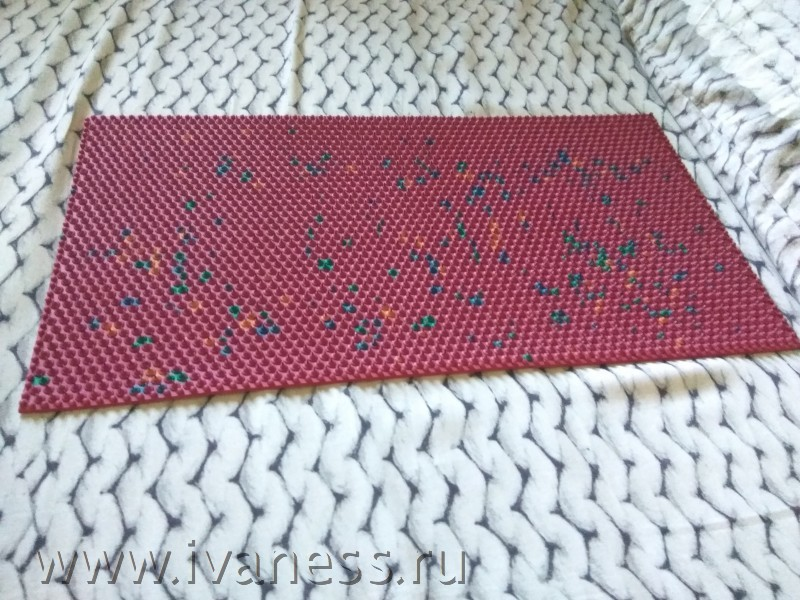
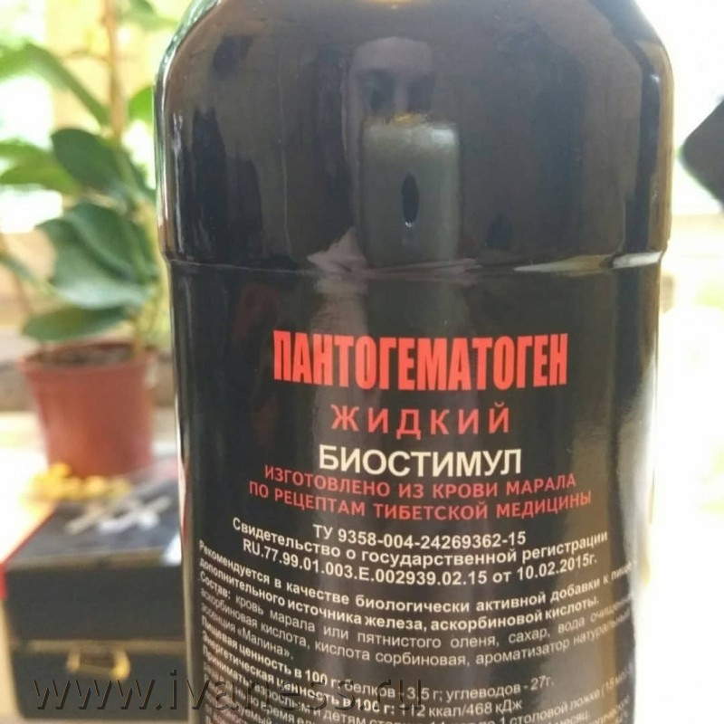
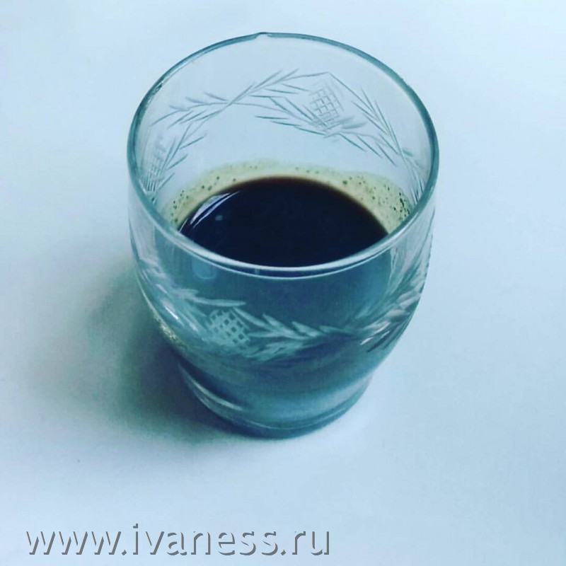

# Луна-Плутон — квадрат, оппозиция или соединение в натальной карте: как проработать?

Здесь буду собирать способы проработки аспекта Луна квадрат Плутон в натальной карте, опробованные на собственном опыте. Впрочем, актуальны они могут оказаться не только для квадратуры Плутон-Луна, но и для оппозиции, и даже соединения. 

Статья не окончена — позже, если будет не лень, я опишу тут, что представляет из себя Плутон-Луна квадрат, оппозиция и соединение.

Сейчас скажу только, что, если вы не можете расслабиться, если циклитесь на любой проблеме до того, пока она полностью не решена, плохо спите, и в целом постоянно на стрёме — то поищите в своей карте напряжение Плутона на Луну или ее диспозитор. И передавайте привет маме и остальным женщинам в роду.

А пока — лишь чистая практика. Ответы на вопрос «что делать?»

Только учтите, что компенсаторика (кстати, вот статья про [компенсаторику в астрологии](https://ivaness.com/kompensatorika-v-astrologii/)) — штука крайне индивидуальная.

И, если вы подумали, что разница в том, имеет ли место Луна квадрат Плутон у женщины или у мужчины — отнюдь. Гендерный аспект — это лишь малая часть.

Компенсаторные меры для каждого необходимо адаптировать ко всему контексту карты. И, отдельным пунктом — к событийным обстоятельствам домов. Тех, в которые попали Луна и Плутон.

Или Марс. Да, к квадратуре от Марса к Луне кое-что из этого тоже можно применить — не случайно же у этих планет одинаковые обители — Овен и Скорпион.

Правда, Марс с Луной нужно компенсировать в обе стороны, ибо тут каждая планета является модификатором для другой.

Ну, и Марс — все-таки сигнификатор куда более простых энергий, чем Плутон. Для него может быть уместна даже такая мера, как ручной домашний труд. Марсизм-Лунатизм, как я его называю. ?

С Плутоном такое не прокатит. Там если и применять усилия — то сверхусилия. Для Плутона всё будет с приставкой «сверх» — он добавляет накала, трэша, драматизма и глубины всему, к чему прикасается.

В общем, хватит прелюдий, поехали.

## Плутон-Луна квадратура, оппозиция, соединение: лежать и стоять на гвоздях

Если вашу Луну бьют такие планеты, как Марс и Плутон (а для моей натальной карты справедливо и то, и другое), то, чтобы это скомпенсировать, нужно добавить прямо в бытовую повседневную физиологическую жизнь чего-то острого, металлического, сурового и трансформирующего.

Если при этом и Луна, и Марс находятся в 12 доме (а у меня именно так) — отличным решением будет реализовать всё это через нетрадиционную медицину. Заодно и здоровью польза.

Рассуждая так, я нашел себе метод — аппликатор Ляпко.

Фактически это — коврик с торчащими из него реальными такими «гвоздиками». Притом — из разных металлов. Что дополнительно создает гальванический эффект, благодаря которому через тело идут слабые токи. Так что даже Уран, тоже имеющий в моей карте отношение к Луне, получает своё.

Сперва я на нем только лежал. Сначала и это было некоторым стрессом — если Луна рачья, то квадрат Плутона делает ее чувствительной в квадрате. 🙂

Потом привык.

Стал на нем стоять.

А, учитывая, что стоять на гвоздях, не медитируя, крайне затруднительно (больно же, блин!) — приходится применять соответствующие навыки, приобретенные [в Индии на Випассане](https://ivaness.com/vipassana-chto-eto/).

Если медититировать — то и переносится легче, и не травматично. Так что условия 12 дома тут создаются по полной.

Позже я расширил свой арсенал. Ведь для компенсации квадратуры Плутон-Луна не меньше подойдет, например, доска Саддху.

В детстве я думал, что лежать и стоять на гвоздях — это что-то из магических способностей продвинутых индийских йогов. Наряду с левитацией.

А теперь делаю это сам. В рамках компенсаторики (компенсаторной астрологии). Для проработке Луна в квадратуре к Плутону и в соединении с Марсом.

  - 
    [<svg width="24" height="24" viewBox="0 0 128 128" version="1.1" xmlns="http://www.w3.org/2000/svg" aria-hidden="true" focusable="false"><path d="M28.9700376,63.3244248 C47.6273373,55.1957357 60.0684594,49.8368063 66.2934036,47.2476366 C84.0668845,39.855031 87.7600616,38.5708563 90.1672227,38.528 C90.6966555,38.5191258 91.8804274,38.6503351 92.6472251,39.2725385 C93.294694,39.7979149 93.4728387,40.5076237 93.5580865,41.0057381 C93.6433345,41.5038525 93.7494885,42.63857 93.6651041,43.5252052 C92.7019529,53.6451182 88.5344133,78.2034783 86.4142057,89.5379542 C85.5170662,94.3339958 83.750571,95.9420841 82.0403991,96.0994568 C78.3237996,96.4414641 75.5015827,93.6432685 71.9018743,91.2836143 C66.2690414,87.5912212 63.0868492,85.2926952 57.6192095,81.6896017 C51.3004058,77.5256038 55.3966232,75.2369981 58.9976911,71.4967761 C59.9401076,70.5179421 76.3155302,55.6232293 76.6324771,54.2720454 C76.6721165,54.1030573 76.7089039,53.4731496 76.3346867,53.1405352 C75.9604695,52.8079208 75.4081573,52.921662 75.0095933,53.0121213 C74.444641,53.1403447 65.4461175,59.0880351 48.0140228,70.8551922 C45.4598218,72.6091037 43.1463059,73.4636682 41.0734751,73.4188859 C38.7883453,73.3695169 34.3926725,72.1268388 31.1249416,71.0646282 C27.1169366,69.7617838 23.931454,69.0729605 24.208838,66.8603276 C24.3533167,65.7078514 25.9403832,64.5292172 28.9700376,63.3244248 Z" /></svg>Мой ТГ-канал по астрологии и ДЧ 😮](https://t.me/ivaness/6)
  

При регулярном применении чего-то такого, битая агрессивными планетами Луна в 12 доме чувствует себя гораздо благостней, легче переносит стрессы и тяготы жизни, а настроение становится куда более стабильным и гармоничным.

_17 июня 2018_

## Луна квадратура Плутон: пить кровь?..

В каком-то странном специализированном магазине случайно набрел на пантогематоген, изготовленный из крови марала. Внезапно ощутил сакральный отклик купить аж две бутылки, хотя ничего о нем не знал. Не об отклике, конечно, а о пантогематогене из крови. 🙂

Потом подумал, что ведь пить кровь мертвого (Плутон) крупного дикого животного (12 дом, где у меня Луна) — отличное компенсаторное действие для квадратуры Луна-Плутон.

На вкус — действительно кровь с малиновым соком.

Теперь, получается, регулярно пью кровь. Рюмками. За обедом. 

А на какие компенсаторные действия для проработки напряженных аспектов готовы вы? 🙂

_18 июля 2018_

## Плутон-Луна квадрат (оппозиция, соединение): жрать тараканов

Чего не сделаешь ради компенсации Плутон-Луна квадрата, друзья мои. Влияние напряженного аспекта Плутона на Луну продолжает требовать размещения его в соответствующей событийности. Ибо в противном случае оно может выбрать событийность само — и не факт, что нам это понравится.

Я уже лежал на гвоздях, пил кровь, а теперь вот пришло время пожирания насекомых.

<figcaption class="wp-element-caption">Сейчас я буду жрать насекомых</figcaption> 

_6 февраля 2019_

Как можно понять из двух последних пунктов, даже просто есть мясо (а уж особенно — если сырое) — тоже вполне рабочий метод размещения квадратуры или оппозиции Плутон-Луна. Или Марс-Луна. На эту тему у меня есть отдельный основательный опыт — [питание хищника Карнивор](https://ivaness.com/pitanie-karnivor-dieta-hishchnika-otzyvy/).

А сюда, пожалуй, свалю вообще весь свой багаж по квадрату Плутон-Луна — не только компенсаторные меры.

## Стихотворение «Смерть рагу» как пример квадратуры Плутон-Луна

Внезапно понял, что моё давнее стихотворение про смерть рагу отлично иллюстрирует квадрат четверодомного Плутона к рачьей Луне. 

Так что если кто вдруг не представляет себе, как до предела накалить простые бытовые лунно-четверодомные темы, внеся в них плутоническую иронию, грязь, драму, героическую гибель и чувство, что вселенные встают и рушатся — то вот. Представьте.

<pre class="wp-block-verse">СМЕРТЬ РАГУ

Уронил свое рагу.
Уронил - и не могу.
Не могу.
Не могу.
Не могу поднять рагу. :(

На дороге пыль и грязь,
Кошки ходят, не таясь.
И собаки тоже ходят.
Да и люди, торопясь.

Не ругайте, я не сноб.
Даже, поняли вы чтоб,
Поясню, что слово "ходят"
Я не в смысле: "топ-топ-топ".

А рагу лежит и ждет.
А рагу меня зовет.
И рагу еще не знает,
Что впустую пропадет.

Я же ведь твое, угу?
Никуда не убегу!
Но такое не могу я,
Не могу поднять рагу. :(

Я жалею. Я люблю.
Я виновен и скорблю.
А вот это вот в желудке
Все равно не потерплю.

Но учила меня мать,
Что свое нельзя бросать,
Что своих не оставляют
На дороге умирать.

И, согнув себя в дугу,
Поднимаю я рагу!

И бросаю его в урну.
Урна - пухом.
Побегу.

<em>17 мая 2013</em></pre>

Ну и, наконец «манифест плутонианца», написанный мной на рубеже 2020 и 2012 года, в период, который более подробно описывается в [статье про квадрат Луна-Солнце](https://ivaness.com/luna-solnce-kvadrat/). Подойдет тем, у кого в натальной карте Плутон имеет отношение к светилам, особенно — в случае напряженностей. Плутонианец — это, в первую очередь, именно человек с такими показателями в натальной карте.

Лично у меня Плутон соединен с Солнцем и находится в квадратуре с Луной — и писал я это самому себе.

## Манифест плутониаца

Ты — солдат Ж@пы.

Сейчас ты на отдыхе, в увольнительной. Но в любой момент может прийти Ж@па — и ты должен будешь делать то, что она потребует.

Может произойти что-то непредвиденное и разрушительное — у тебя или близких. И нужно будет идти и решать проблему. Или ты можешь заболеть. И придется подчиниться симптомам болезни и условиям борьбы с ней. Да мало ли вариантов.

Поэтому сейчас старайся по максимуму получать от жизни удовольствие. Это — не так просто, как может показаться, это требует внимания. Делай только то, что действительно нравится или действительно необходимо.

Универсальный критерий, как это определить — понимать, что происходящие события в любой момент могут прекратиться из-за обстоятельств непреодолимой силы. Мог бы ты сейчас потратить время и силы приятнее или продуктивнее — с учетом этого понимания? Не пожалеешь о том, что занимался тем, чем занимался, а не чем-то другим? Если нет — значит всё в порядке. Если да — ты делаешь что-то не то.

Если не знаешь, чем заняться — совершай базовые действия. Побрейся и помойся, пока есть возможность. Поешь. Сделай зарядку. Будь готов. Ибо в следующий момент Ж@па может позвать тебя, и время и силы придется тратить уже на нее.

В какой бы ситуации ты ни оказался — будет лучше, если голод не сразу начнет отвлекать и лишать энергии и здравомыслия. Если дискомфорт из-за желания побриться или помыться возникнет позже, нежели раньше. Если тело и нервы будут в хорошей форме.

**Хинт, особенно хорошо работающий для тех, у кого, как у меня, не только связь Плутон-Луна, а еще и Плутон-Солнце**:

Ты можешь придумать себе Ж@пу сам. Некую большую сверхзначимую задачу — такую, чтобы ей пришлось подчинить всё остальное.

Это — работающий способ стать хозяином Ж@пы. Так не ты подчиняешься ей, а она тебе. Тогда она порой даже даёт возможность достичь результатов, превышающих твои представления о собственных возможностях.

<meta charset="utf-8" />

_29 декабря 2020_

