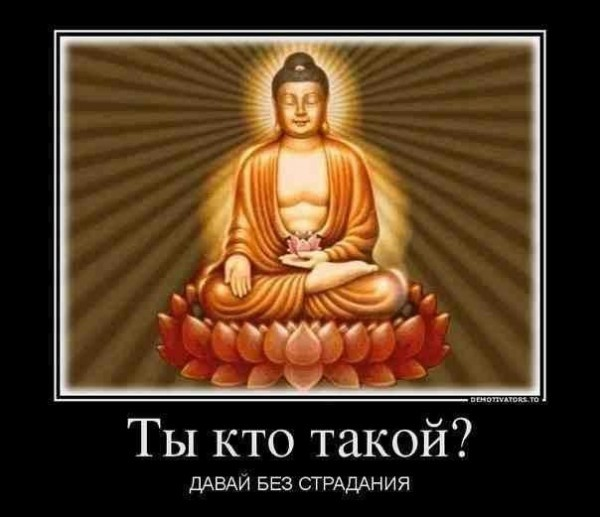

# Випассана — что это такое? Как я сидел в «добровольной тюрьме». Почему Випассана — не практика молчания

<blockquote class="wp-block-quote is-layout-flow wp-block-quote-is-layout-flow">
  

    Вступление, содержащее суету, сборы, высокопарность и немножко теории. Из которого читатель узнаёт, что такое Випассана, почему называть практикой молчания Випассану — ошибка, и практикой глубокого расслабления — тоже. И как на Випассане оказался автор.
  

</blockquote>

«Хочешь сам себя на десять дней в тюрьму посадить?!» — изумляется мой сосед по дому в Гоа.

Перебрав в уме пафосные банальности вроде: «Тюрьма — она в голове!», решаю лучше ответить просто и честно:

«Ну а чего. Интересно же, что там за методика».

Сосед смотрит так, словно от гоанской атмосферы у меня окончательно поехала крыша.

«Это именно так», — позже подтверждает и [Ква](http://ivaness.ru/page/vpervye-v-indii), — «Я, в том числе, потому и пошла. Всегда было интересно в тюрьме посидеть».

Вообще випассана (ударение на второй слог) — это такая техника медитации. Но в данном случае речь идёт про десятидневный курс обучения этой практике в специальном Медитационном Центре в суровых условиях всевозможных ограничений.

Чтобы вам было проще различать, при упоминании курса в целом я буду писать «Випассана» с большой буквы, а говоря о медитативной технике — с маленькой.

<blockquote class="wp-block-quote is-style-thumbs-up is-layout-flow wp-block-quote-is-layout-flow">
  

    К слову, сам я с 2008 года пользуюсь техникой «[Турбо-суслик](https://ivaness.com/wp-content/uploads/turbo-suslik.pdf)». По сути своей — это то же депрограммирование подсознания, что и Випассана — только иначе организованное. Применяю так долго не потому, что «суслик» недостаточно эффективен, а наоборот — он настолько удобен, что чистить ум от порождаемого событиями материала стало как бы привычкой гигиены. Несмотря на комичное название, грубую манеру изложения автора и кажущуюся несерьезность метода, которые являются отличным фильтром, отделяющим праздно любопытствующих от тех, кому действительно нужны результаты, это — одна из самых эффективных и глубоких методик, помогающих освободиться от того хлама в голове, который блокирует нам способность нормально жить. Кроме шуток. Мою жизнь когда-то он прям изменил.
  

</blockquote>

Так вот. [Центры Випассаны](http://www.ru.dhamma.org/Introduction.1817.0.html?&L=19) (официальный сайт) есть по всему миру.

Но мне почему-то хочется пройти курс прямо в стране ее происхождения. Где эту технику придумал сам Сидхартха Гаутама, более известный как Будда.

И куда вернул ее из Бирмы, в которой она, согласно легенде, сохранилась в изначальной чистоте, автор данной методики обучения [С. Н. Гоенка](https://ru.wikipedia.org/wiki/%D0%93%D0%BE%D0%B5%D0%BD%D0%BA%D0%B0,_%D0%A8%D1%80%D0%B8_%D0%A1%D0%B0%D1%82%D1%8C%D1%8F_%D0%9D%D0%B0%D1%80%D0%B0%D0%B9%D1%8F%D0%BD). После чего Випассана и стала распространяться по миру его усилиями.

Тем более, что, по совести, проходить Випассану в России где-нибудь мне будет явно лень. Это ж ехать куда-то надо специально.

Центр в Ченнае, а не где-либо еще (в Индии их очень много), я выбираю просто потому, что в день завершения собираюсь прямо оттуда лететь в Таиланд. Даже билет уже купил.

Ограничения, согласно кодексу, следующие. На протяжении всего курса следует воздерживаться от:

  - 
    убийства живых существ;
  
  - 
    воровства;
  
  - 
    лжи;
  
  - 
    всех видов сексуальной активности;
  
  - 
    принятия любых опьяняющих веществ.
  

Это — пункты так называемой Шилы, моральной составляющей Випассаны. На деле запреты строже.

Вопрос с ложью решен радикально. По целому ряду причин запрещено как-либо общаться с остальными участниками курса вообще. Только с персоналом. Быстро, коротко, тихо и по делу.

Соврать при таком раскладе в принципе крайне сложно. Кроме того, решается проблема обмена впечатлениями, в результате которого студенты неизбежно начнут сравнивать свои успехи с чужими, заставляя ум генерировать всё новый ментальный хлам, вместо того, чтобы от него освобождаться.

Наконец, в молчании просто проще сконцентрироваться. Сплошная польза.

Поэтому называть випассану «практикой молчания» — ошибка. Випассана — это практика медитаций. Молчание лишь является одним из условий на курсе, а вовсе не его основной целью или методом. Еще более странно называть випассану «практикой глубокого расслабления» — а я даже такое в интернете видел. Может вы и правда расслабитесь в процессе медитации. А может, наоборот, напряжетесь. 🙂 Однако задача ее — в другом.

Еще запрещено пользоваться телефонами, компьютерами и что-либо читать. Все это отбирают при оформлении, а отдают только в последний день. Точнее — в предпоследний. Десятый.

Если верить расписанию, всё время с подъема в 4:00 до отбоя в 21:30, кроме завтрака, обеда, полдника и небольших перерывов на отдых, занимают медитации.

«Сбегают оттуда больше всего на второй день и на шестой», — говорит Дюс, — «На второй — вообще просто слабаки по жизни, которые не понимали, куда ехали, и после первого же дня «сдулись». Но на шестой день тоже может нехило крышу сорвать».

«Да агрессия, возможно, попрет», — рассеянно отвечаю я, отхлебывая приготовленный им чай, — «У меня много агрессии задавленной».

«Ты смотри, если на шестой день накроет, ходи там глаза в пол, взглядом ни с кем не встречайся, ни на кого не бросайся, разве только в стену кулаком», — Серёга подливает мне еще чаю.

«Насколько я тебя знаю, на пятый… ой, на шестой день у тебя может там случиться своего рода срыв. У меня случился», — говорит Ква.

«Серёга говорил. Так а что происходит, если сказать, мол, всё, хочу уйти отсюда?..»

«А они не дадут. Начнут: «Подождите еще день, поговорите с учителем…» Затаскают, короче, по всей этой бюрократии. Если будешь нарушать правила — тебя выгонят. Но если захочешь уехать сам — просто так не отпустят. Такой вот парадокс».

«Очень жарко в Ченнае конце марта», — говорит [Самир](http://ivaness.ru/page/vpervye-v-indii), — «Возьми какую-нибудь другую одежду. Которую не жаль».

  [Продолжение: расписание и Випассана — день заезда <strong>→</strong>](https://ivaness.com/raspisanie-vipassana/)

